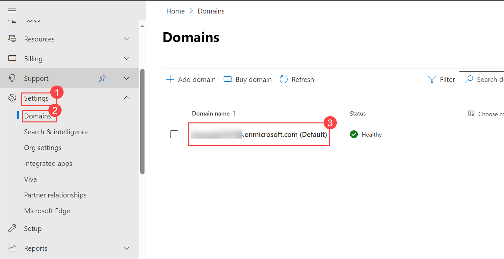
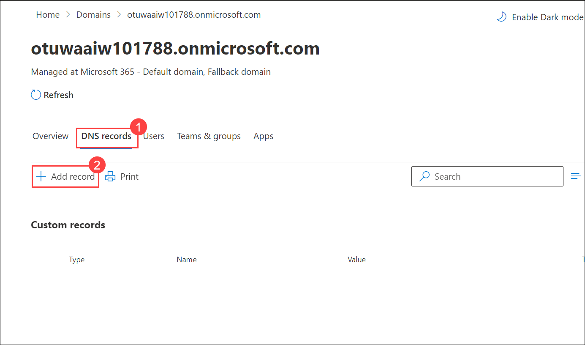
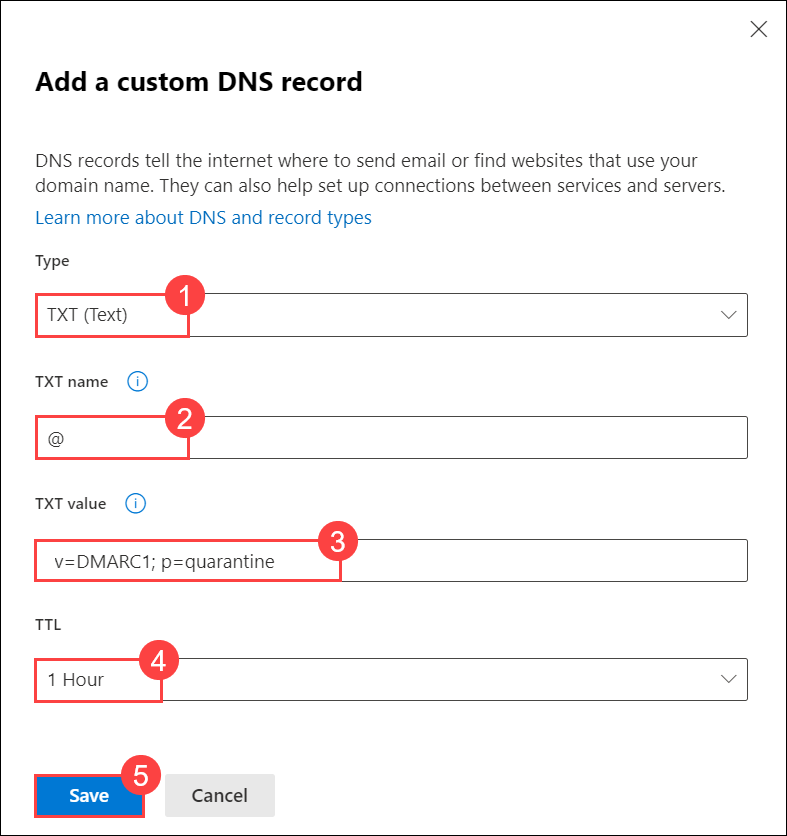
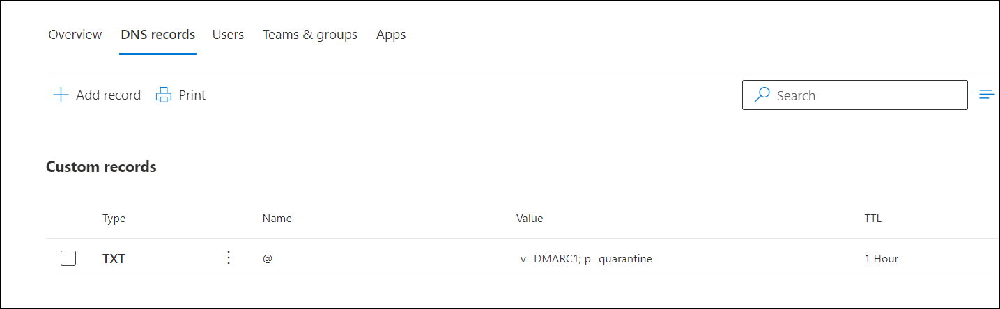

## Lab 02 - Configure Email Authentication

## Lab scenario

In this Lab we will Configure Email authentication (also known as email validation) which is a group of standards that tries to stop email messages from forged senders (also known as spoofing). We are using the @*.onmicrosoft.com domain for email (also known as the Microsoft Online Email Routing Address or **MOERA** domain) authentication using **DMARC** (Domain-based Message Authentication, Reporting, and Conformance) in this lab.

## Lab objectives (Duration: minutes)

In this lab, you will complete the following tasks:
- Exercise 1: Configure DMARC For MOERA Domain.

## Architecture Diagram

### Exercise 1: Configure DMARC For MOERA Domain

As we are using the MOERA domain for email, SPF (Sender Policy Framework) and DKIM (DomainKeys Identified Mail) record will be already configured, we only need to manually set up the DMARC record.

1. Open the Microsoft 365 admin center at https://admin.microsoft.com.

1. On the left-hand navigation, select **Show All**.

1. Expand **Settings** and press **Domains**.

   

1. Select your tenant domain.

1. On the page that loads, select **DNS records**.

1. Select **+ Add record**.

   

1. A flyout will appear on the right. Ensure that the selected Type is **TXT** (Text).

1. Add **TXT name** as **@** and **TXT value** as **v=DMARC1; p=quarantine**.

1. Select **TTL** to **1 Hour**.

1. Click on **Save**.

   

1. Back on the **DNS records** tab, the entry is listed.

   

## Review
In this lab, you will complete the following tasks:
- Configure DMARC For MOERA Domain.

