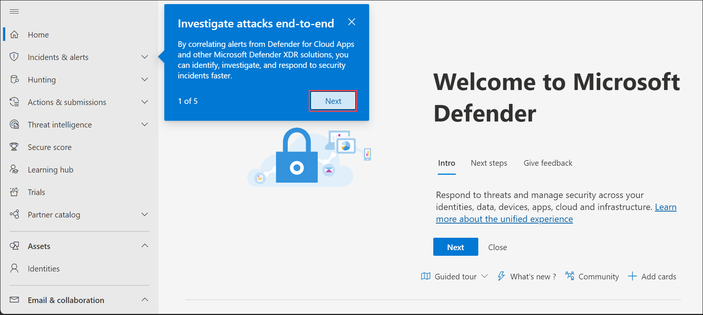

## Lab 02 - Configure Email authentication

## Lab scenario
In this lab you will explore about the *Microsoft Defender Portal*.

## Lab objectives (Duration: 120 minutes)

In this lab, you will complete the following tasks:
- Task 1: Configure DMARC For MOERA Domain.

## Architecture Diagram

### Task 1: Configure DMARC For MOERA Domain

1. Open the Microsoft 365 admin center at https://admin.microsoft.com.

1. On the left-hand navigation, select **Show All**.

1. Expand **Settings** and press **Domains**.

   

1. Select your tenant domain.

1. On the page that loads, select DNS records.

1. Select + Add record.
