## Lab 03 - Configure Protection Policies (Anti-Spam, Anti-malware and Anti-phishing) 

## Overview

In Microsoft 365 Defender, use Defender for Office 365 to set up Anti-Spam, Anti-Malware, and Anti-Phishing measures. Access the Security & Compliance Center to create policies tailored to detect and manage spam emails, shield against malicious attachments and links, and identify phishing attempts.

## Lab scenario

In this lab, you will Configure Anti-Spam, Anti-Malware, and Anti-Phishing policies in Microsoft Defender for Office 365 involves setting up rules to detect unwanted emails (spam), safeguard against malicious software (malware), and identify and block phishing attempts.

## Lab objectives (Duration: minutes)

In this lab, you will complete the following tasks:
- Exercise 1: Configure Anti-Spam Policy
- Exercise 2: Configure Anti-malware Policy
- Exercise 3: Configure Anti-phishing Policy

## Architecture Diagram

   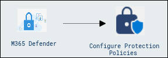

## Exercise 1: Configure Protection Policies

### Task 1: Configure Anti-Spam

Anti-spam policies control the configurable settings for spam filtering. Anti-Spam policy filters incoming and outgoing emails, using various techniques like content analysis and sender reputation checks to detect and block spam.

1. Go to Microsoft Defender Portal at https://security.microsoft.com/.
2. Go to **Settings** > **Email and Collaboration** > **Policies & rules**> Select the **Threat policies**.
   
   

3. Under Policies Select the **Anti-spam**.

   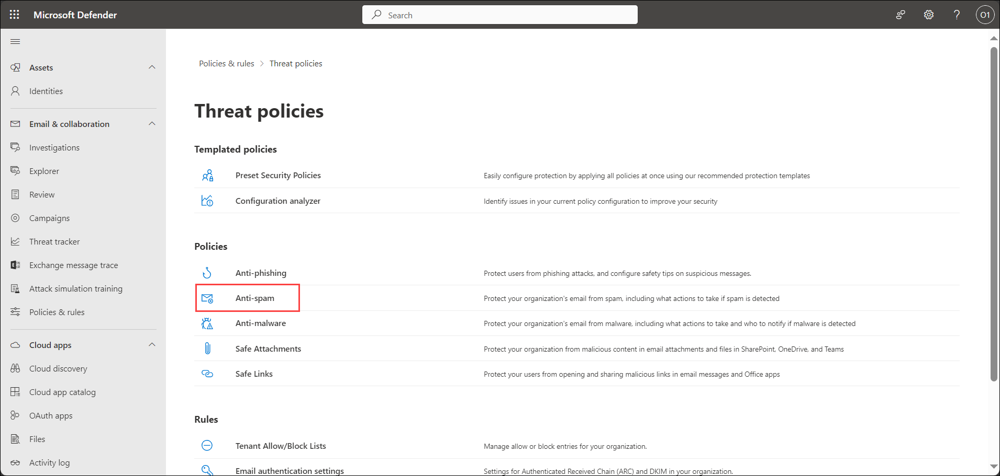
   
4. Select **Create Policy** > **Inbound**.

   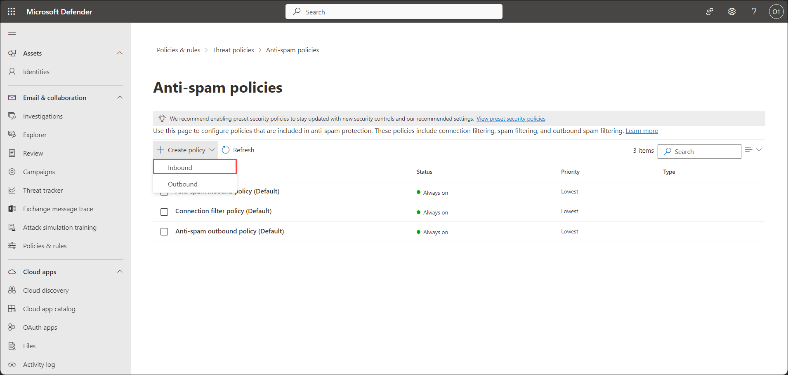

5. Under Name your policy tab provide **Name** : anti-spam-<inject key="DeploymentID" enableCopy="false" /></inject> and Description: anti-spam and select Next.

   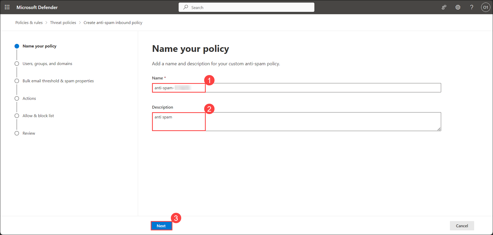

6. Under Users, groups and domains tab add the Users, groups and domains to be included in the Anti spam policy and select Next.

   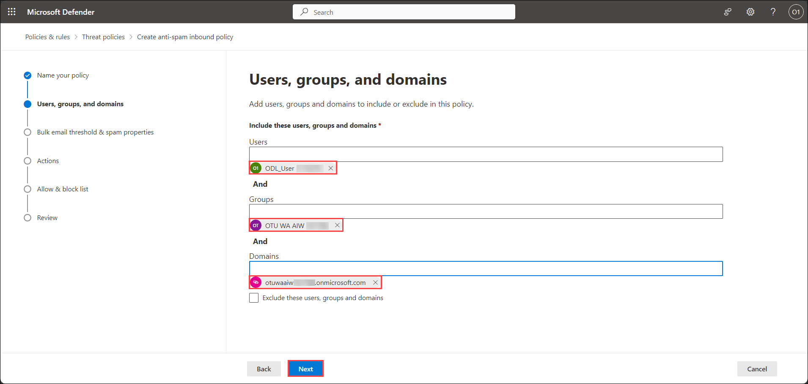

7. Under Bulk email threshold & spam properties tab. Keep the default option selected(If you want to do configurations according to the custom policy. you can add it here). and select Next.

   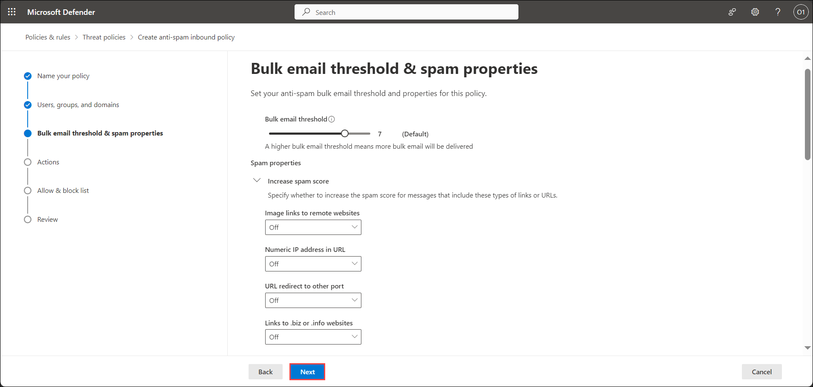

8. Under Actons tab. Keep the default option selected and select Next.

   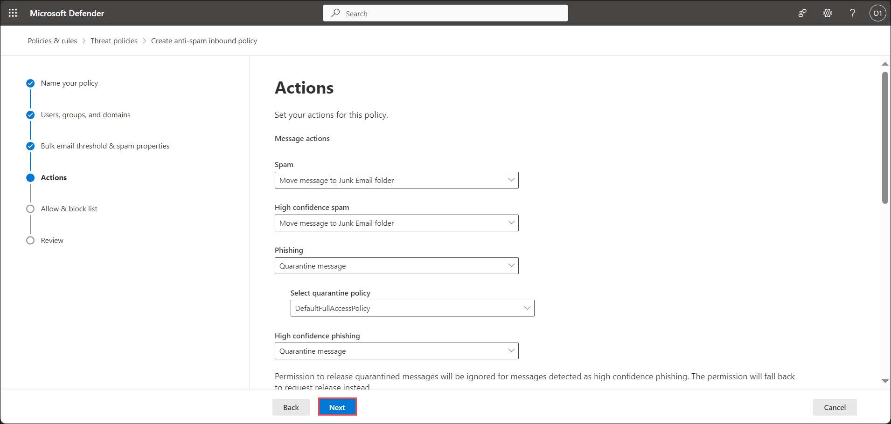

9. Under Allow & block list tab. Provide the Allowed and Blocked senders and Domains list and select Next.

   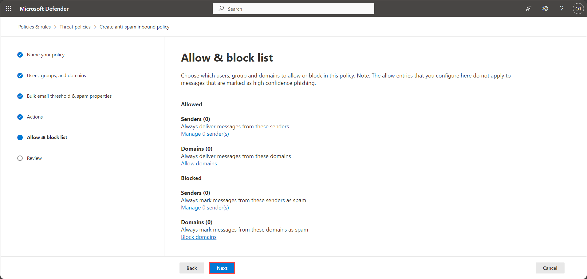

10. Under Review tab. Select Create button.

    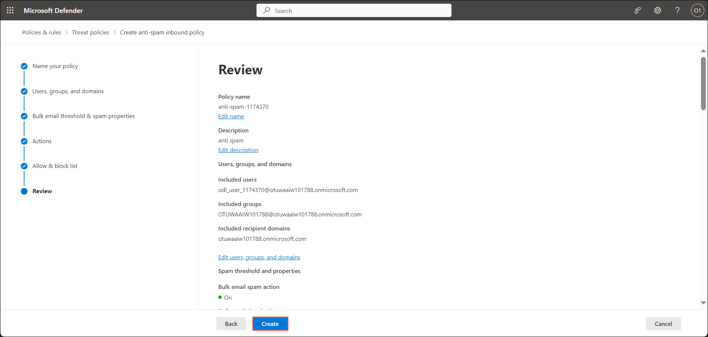

### Task 2: Configure Anti-malware

Anti-Malware policies are designed to safeguard against malware, viruses, spyware, and other harmful software that could be transmitted through emails. Anti-Malware policies scan incoming and outgoing emails for malicious content like malware and viruses. They use signature-based and behavior-based detection to identify threats, taking predefined actions upon detection, such as quarantining or deleting malicious attachments or links.

1. Go to Microsoft Defender Portal at https://security.microsoft.com/.
2. Go to **Settings** > **Email and Collaboration** > **Policies & rules**> Select the **Threat policies**.
   
   

3. Under Policies Select the **Anti-malware**.

   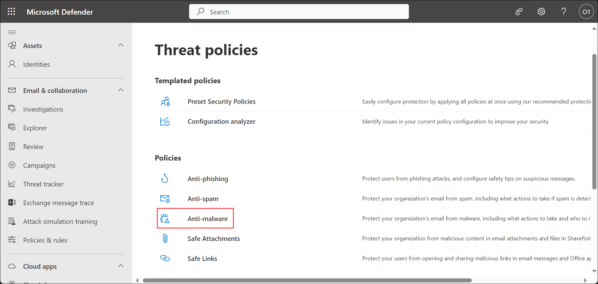

4. Select **Create** in Anti-malware tab.

   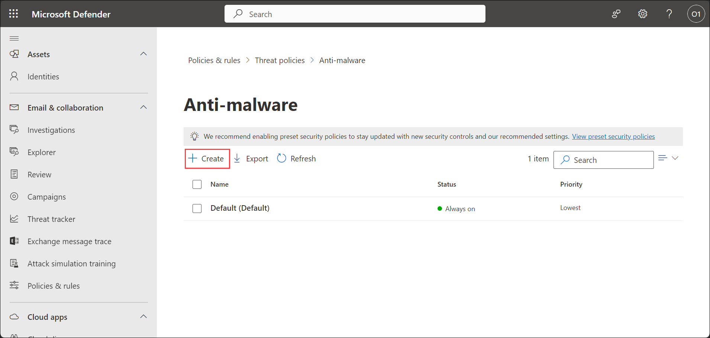

5. Under Name your policy tab provide **Name** : anti-malware-<inject key="DeploymentID" enableCopy="false" /></inject> and Description: Malware Policy and select Next.

   

6. Under Users and domains tab add the Users, groups and domains to be included in the Anti malware policy and select Next.

   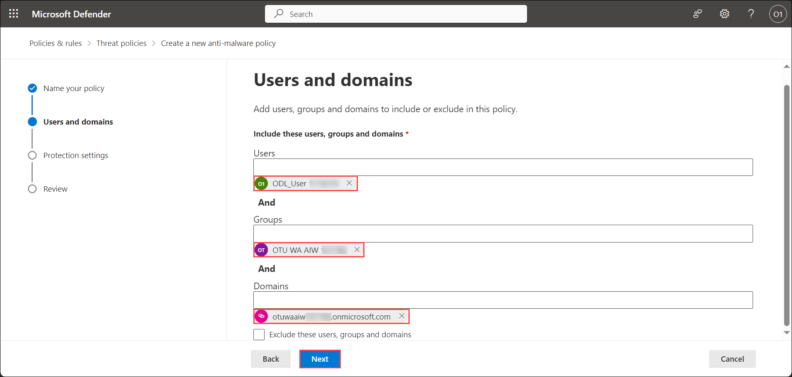

7. Under Protected settings tab. Keep the default option selected and select Next.

   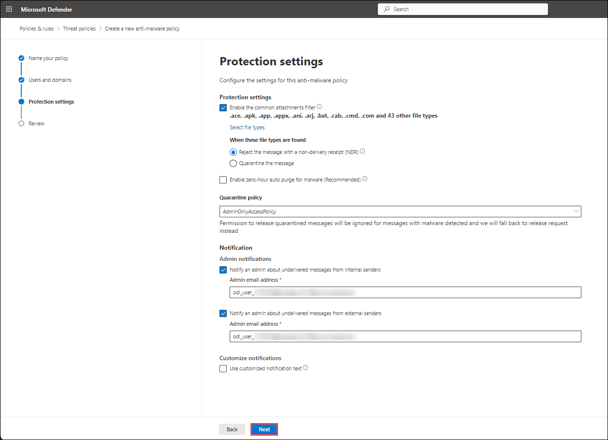

8. Under Review tab. Select Create button.

   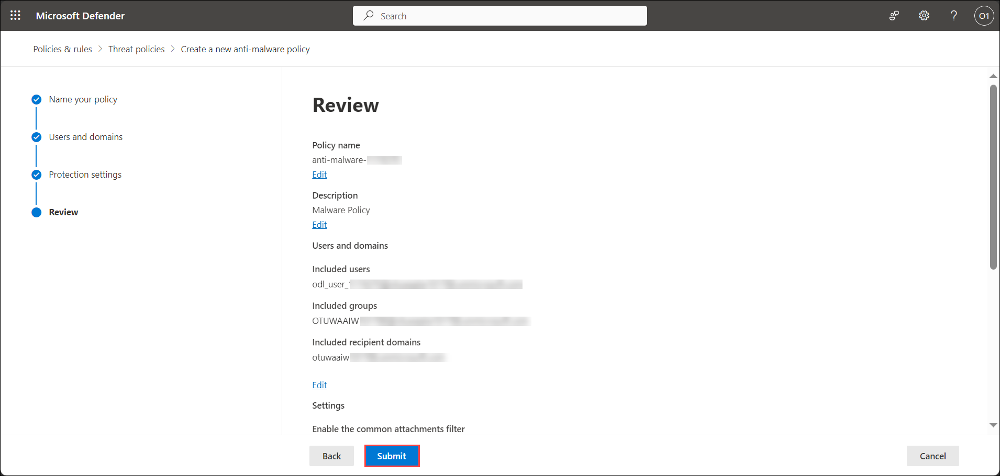

### Task 3: Configure Anti-phishing

Anti-phishing in Microsoft Defender for Office 365 is a comprehensive security feature designed to protect against phishing attacks within emails. Anti-phishing feature works by continuously scanning incoming emails in real-time, employing techniques like suspicious URLs and content analysis to detect potential phishing threats.

1. Go to Microsoft Defender Portal at https://security.microsoft.com/.
2. Go to **Settings** > **Email and Collaboration** > **Policies & rules**> Select the **Threat policies**.
   
   

3. Under Policies Select the **Anti-phishing**.

4. Under policy name tab provide **Name** : anti-phishing-<inject key="DeploymentID" enableCopy="false" /></inject> and Description: anti phishing and select Next.

   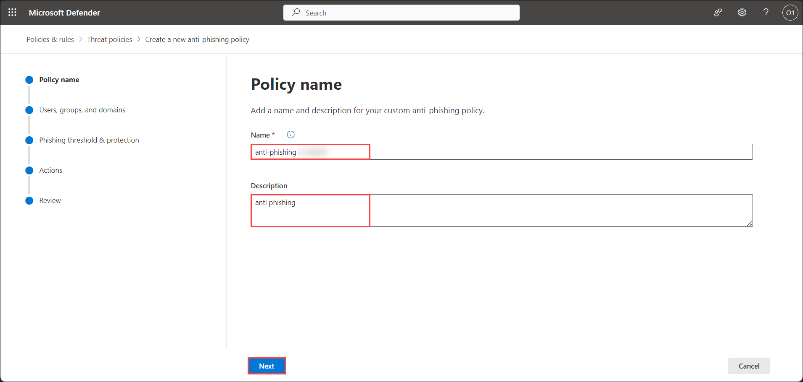

5. Under Users, groups and domains tab add the Users, groups and domains to be included in the Anti phishing policy and select Next.

   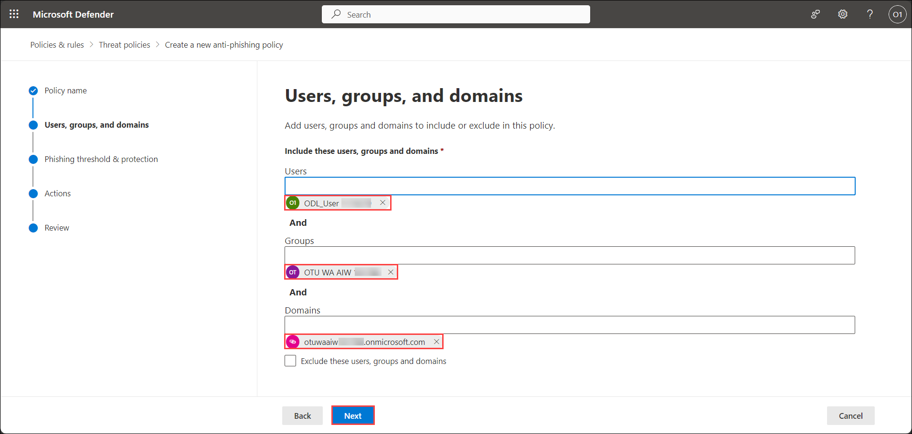

6. Under Phishing threshold & protection tab add the senders and custom domains as required and select Next.

   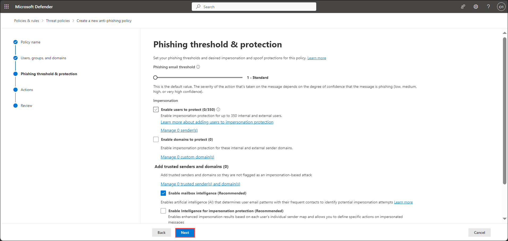

7. Under Review tab. Select Create button.

   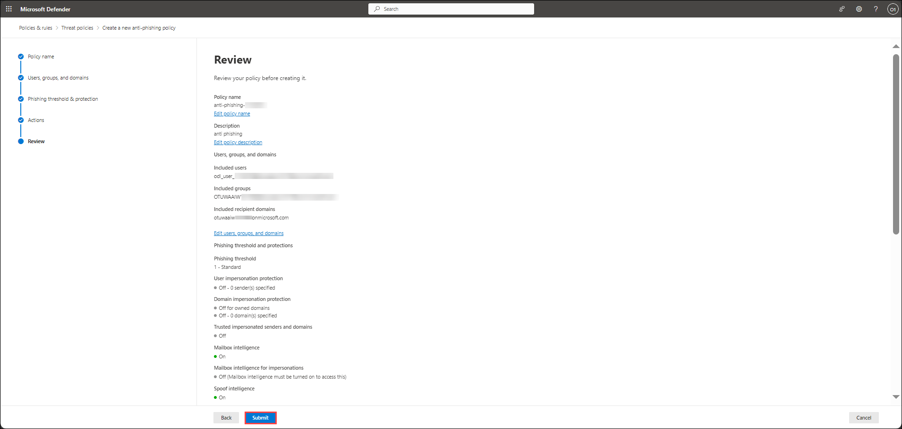

## Review
In this lab, you will complete the following tasks:
- Configure Anti-Spam Policy
- Configure Anti-malware Policy
- Configure Anti-phishing Policy
