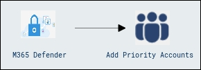
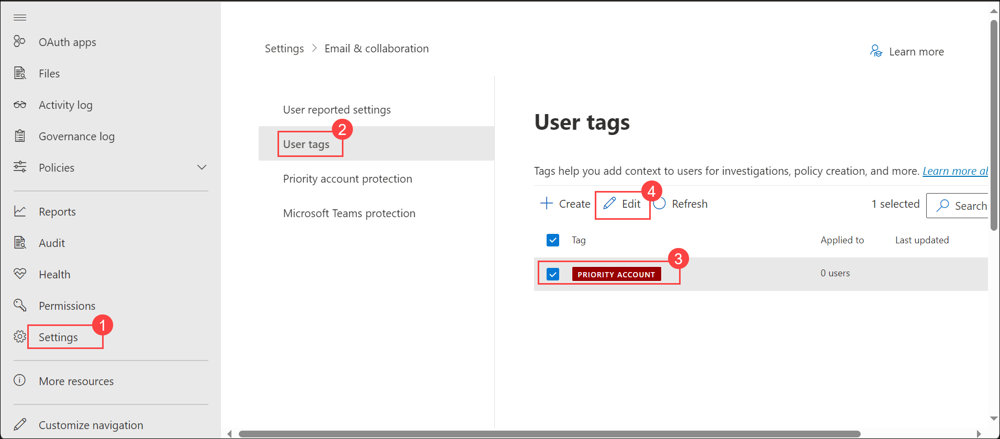
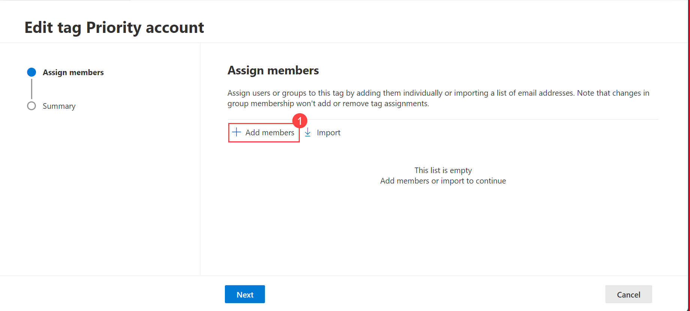
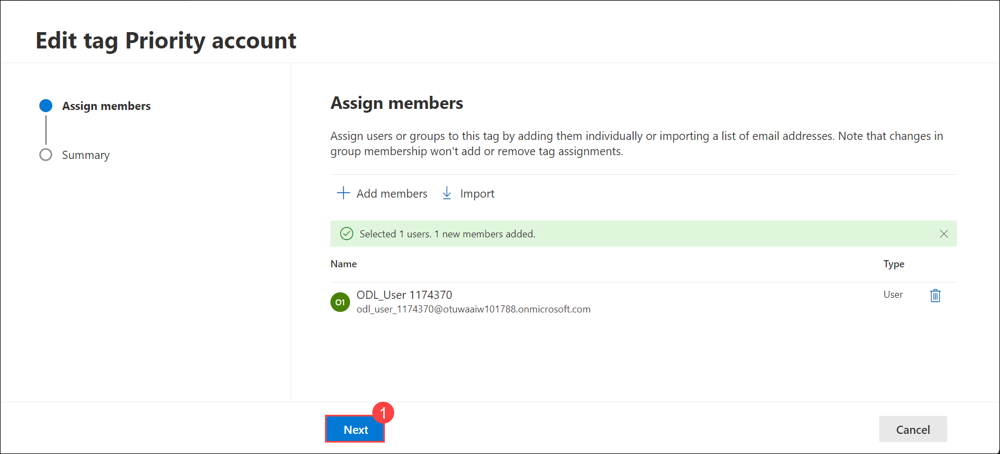
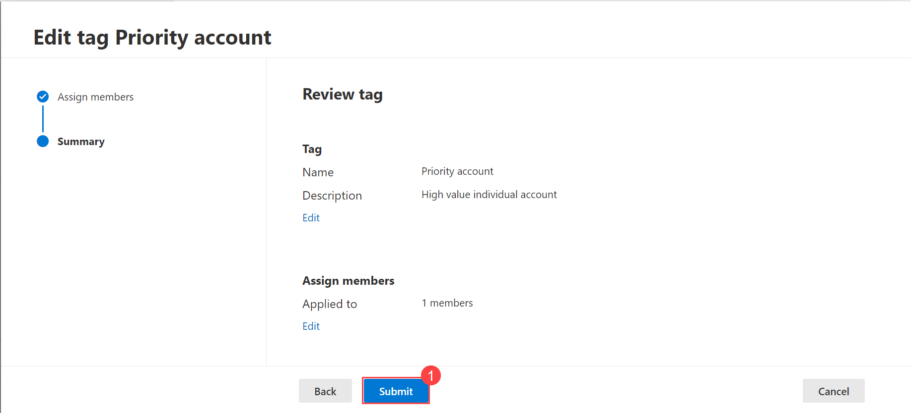
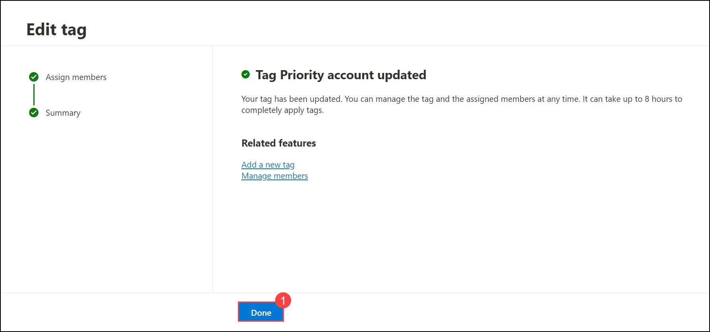
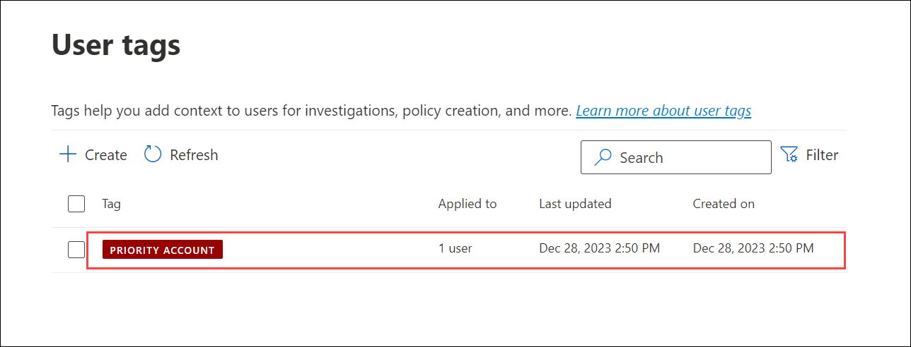

## Lab 04 - Configure Priority Accounts

## Lab scenario

In this Lab we will Configuring Priority Accounts, which involves identifying and designating specific user accounts or groups as high-priority targets for security monitoring and protection. These priority accounts typically include key executives, IT administrators, or individuals with access to sensitive data or critical systems. Tagging an account as a priority account will enable the additional protection tuned for the mail flow patterns targeting company executives, along with extra visibility in reports, alerts, and investigations.

## Lab objectives (Duration: minutes)

In this lab, you will complete the following tasks:
- Exercise 1: Add Priority Accounts.

## Architecture Diagram

   

### Exercise 1: Add Priority Accounts. 

By concentrating security efforts on Priority Accounts, organizations can effectively strengthen their overall security posture and better protect their most crucial accounts from potential cyber threats within the Microsoft 365 ecosystem.

1. Go to Microsoft Defender Portal at https://security.microsoft.com/.

1. Go to **Settings** > **Email and Collaboration** > **User Tags**> Select the priority account tag is already created for you by default, click on **Edit**.

   

1. Then, **Add members** > **Add** to add members to the priority account (Select your User).

   
      

1. Click on **Next**.

   

1. Click on **Submit** and **Done**.

   
   

1. It will navigate back to **User tag** page, user is added.
   
      

## Review
In this lab, you will complete the following tasks:
- Add Priority Accounts.
   

