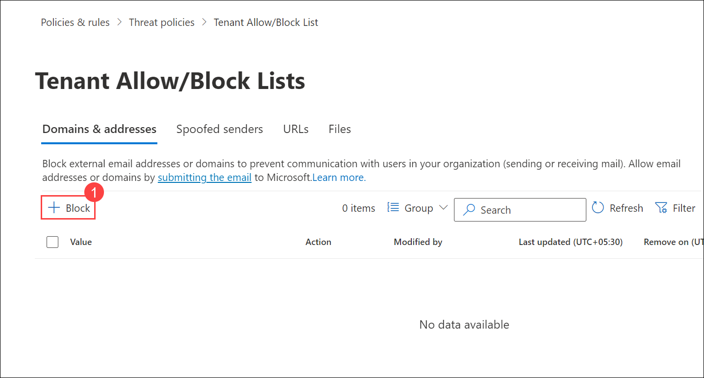
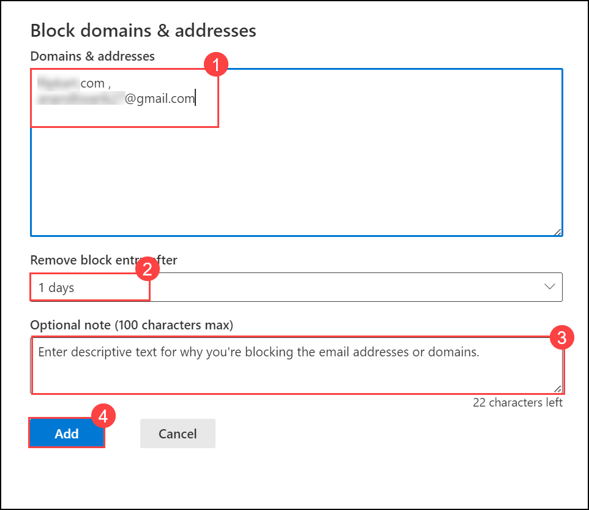
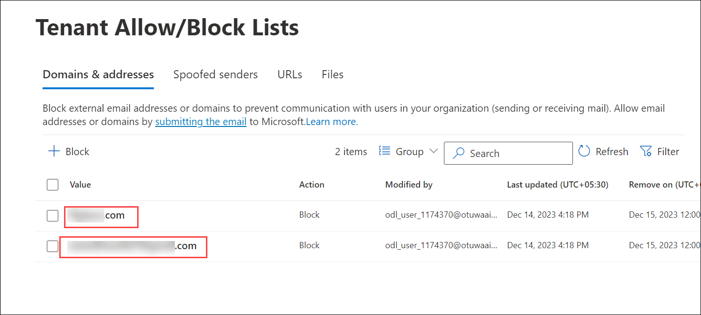

## Lab 05 - Configure Block/Allow Lists

## Lab scenario
In this lab you will explore about the *Microsoft Defender Portal*.

## Lab objectives (Duration: 120 minutes)

In this lab, you will complete the following tasks:
- Task 1: Create Block Entries

## Architecture Diagram

### Task 1: Create Block Entries

1. Go to Microsoft Defender Portal at https://security.microsoft.com/.

1. Go to **Policies & rules** and Click on **Threat Policies**.

   

1. Navigate to **Rules** section, Select **Tenant Allow/Block Lists**.

   

1. Click on **+ Block**.

   

1. In the **Block domains & addresses** flyout that opens, configure the following settings:
   - **Domains & addresses**: Enter one email address or domain per line, up to a maximum of 20.
   - **Remove block entry after**: Select 1 days.
   - **Optional note**: you can optional note here.

1. When you're finished in the Block domains & addresses flyout, select **Add**.

   

1. Back on the **Domains & email addresses** tab, the entry is listed.

   

## Review
In this lab, you will complete the following tasks:
- Create Block Entries.

