## Lab 06 - Launch Phishing Simulation Campaigns. 

## Lab scenario

Phishing Simulation Campaigns in Microsoft 365 Defender involve creating fake phishing emails to test and educate users. These campaigns mimic real attacks, evaluating users' responses to improve their awareness. They're set up by crafting realistic emails, sent to targeted groups, and monitored for user interactions. Reports are generated to analyze user behavior and provide immediate feedback for learning. Continuous analysis helps adapt training to enhance security awareness, strengthening defenses against actual phishing threats.

## Lab objectives (Duration: minutes)

In this lab, you will complete the following tasks:
- Task 1: Simulate a Pishing Attack.

## Architecture Diagram

### Task 1: Simulate a Pishing Attack.

1. Go to Microsoft Defender portal at https://security.microsoft.com.

1. Go to **Email & collaboration** > **Attack simulation training** > **Simulations** tab and Click on **Launch a Simulation**.

      
   
1. On the **Select technique** page, select **Credential Harvest** and Click on **Next**.

      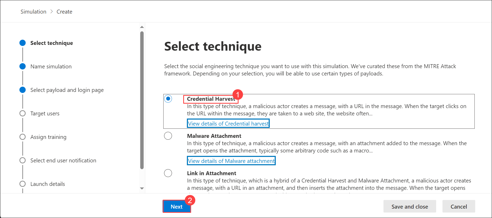
   
1. On the Name simulation page, configure the following settings:

   - **Name**: Enter a unique, descriptive name (**Creadentials_Simulation**) for the simulation.
   - **Description**: Enter an optional detailed description for the simulation.
  When you're finished on the Name simulation page, select **Next**.

   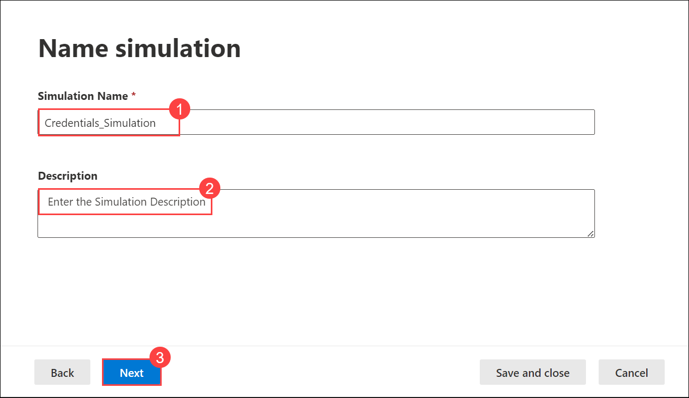

1. On the **Select payload and login page** page, you need to select **Microsoft Account Password Reset** and Click on **Next**.

      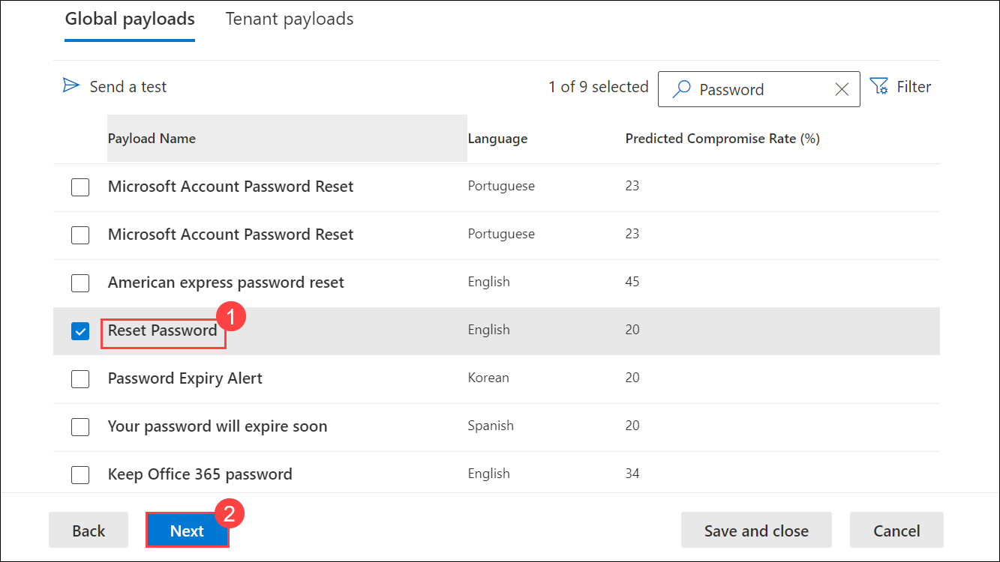

1.  On the **Target users** screen, Select **Include only specific users and groups** and Click **Add users**.

      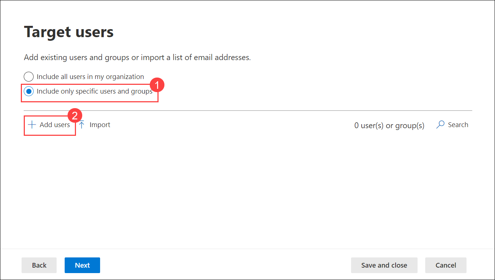

1.  Select for your user, Click on **Add 1 User(s)**.

      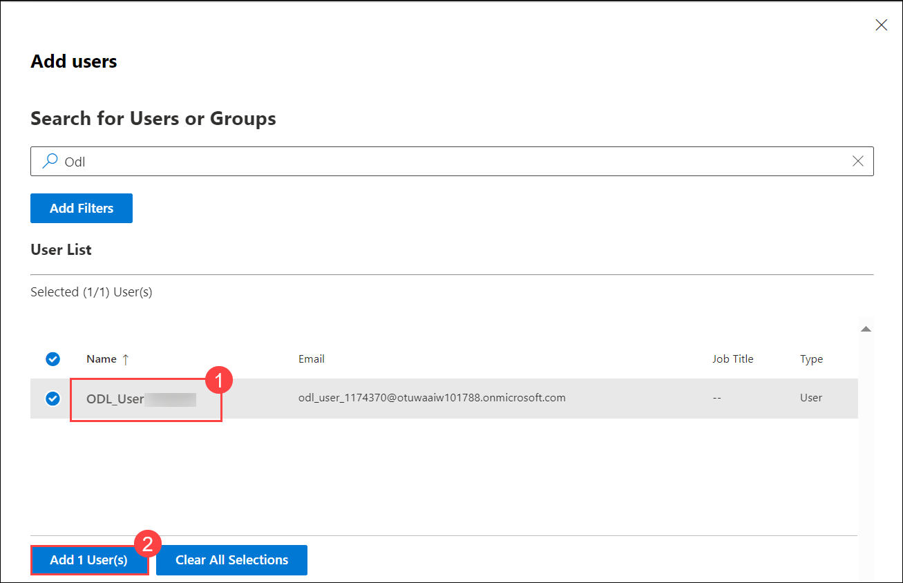

1. Click on **Next**.

      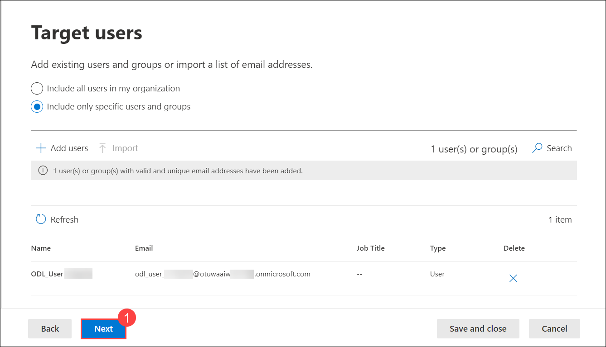

1. On the **Exclude Users** page and Click on **Next**.

      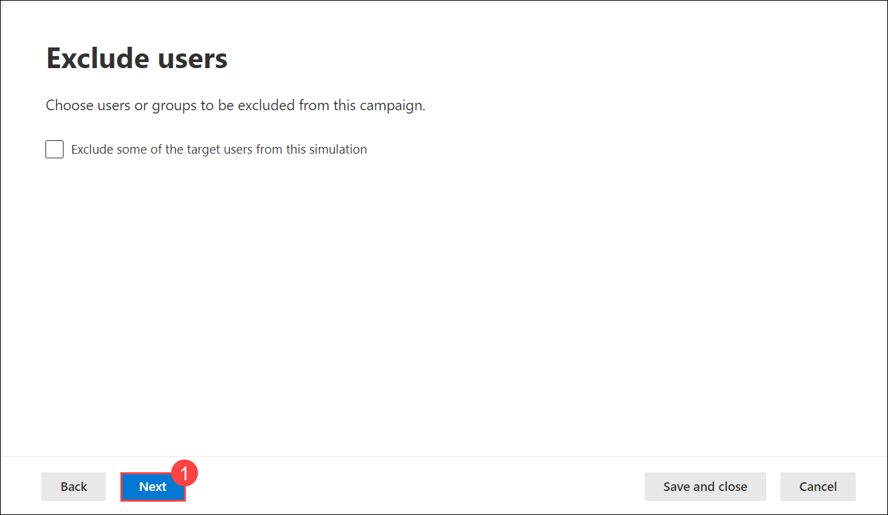

1.  On the **Assign training** page Select the Recommended **Microsoft training experience** and **Assign training for me**, Select **Due Date** as **7 days after Simulation ends**, Click on **Next**.

      

1. On the **Select Phish landing page**, select **Use landing pages from library** and **Payload Indicator**, Under *Global landing pages* select **Microsoft Landing Page Template 2**  and Click on **Next**.

      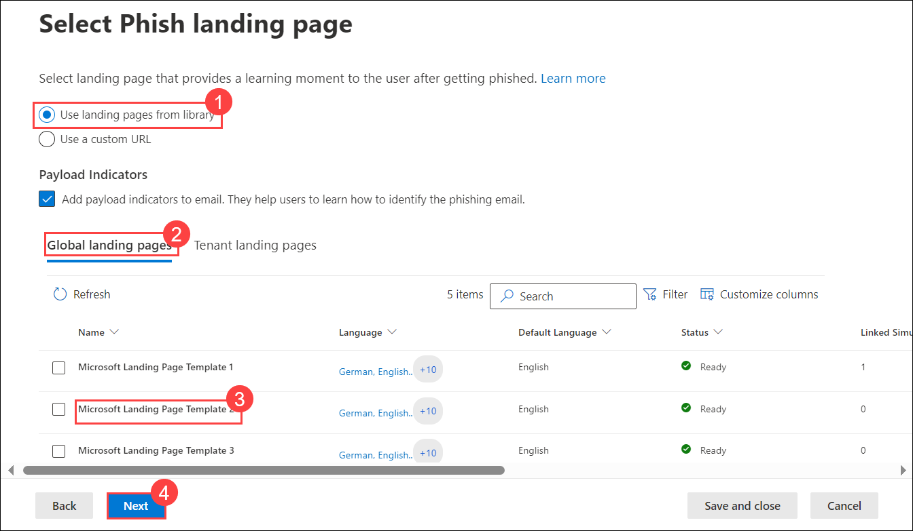

1.  **Select end user notification** page , Select **Microsoft default notification (recommended)** and under the *Notifications* section, In  the  *Microsoft default notification Positive reinforcement notifications* select the **Deliver during simulations** and in *Microsoft default training reminder notification* select the **Twice a week**, Click on **Next**.

      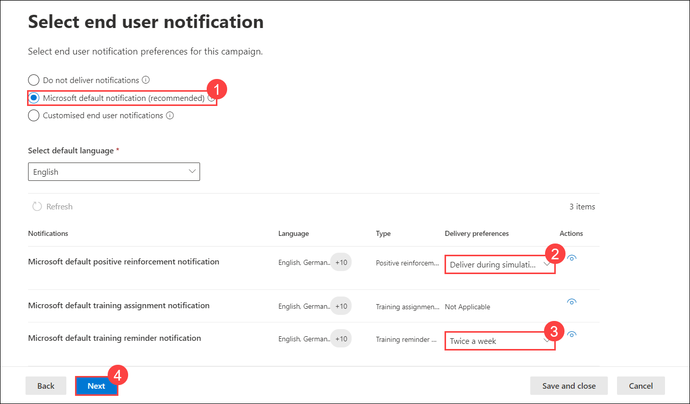

1. On the **Launch details** page, Click on **Next**.

      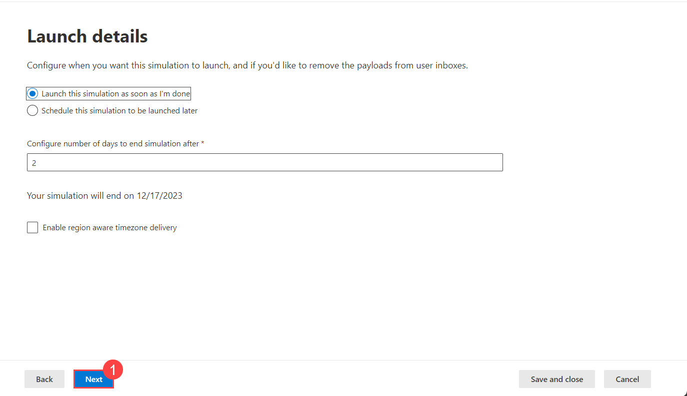

1. In *Review Simulation* page, **Send a test** and Click on **Submit**.

      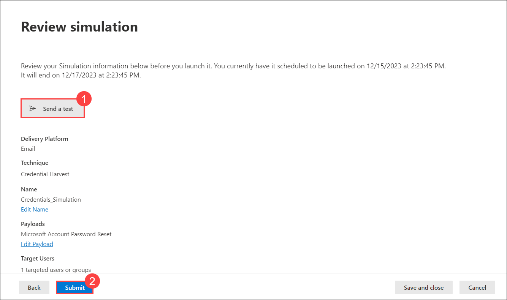

1. Click on **Done**.

      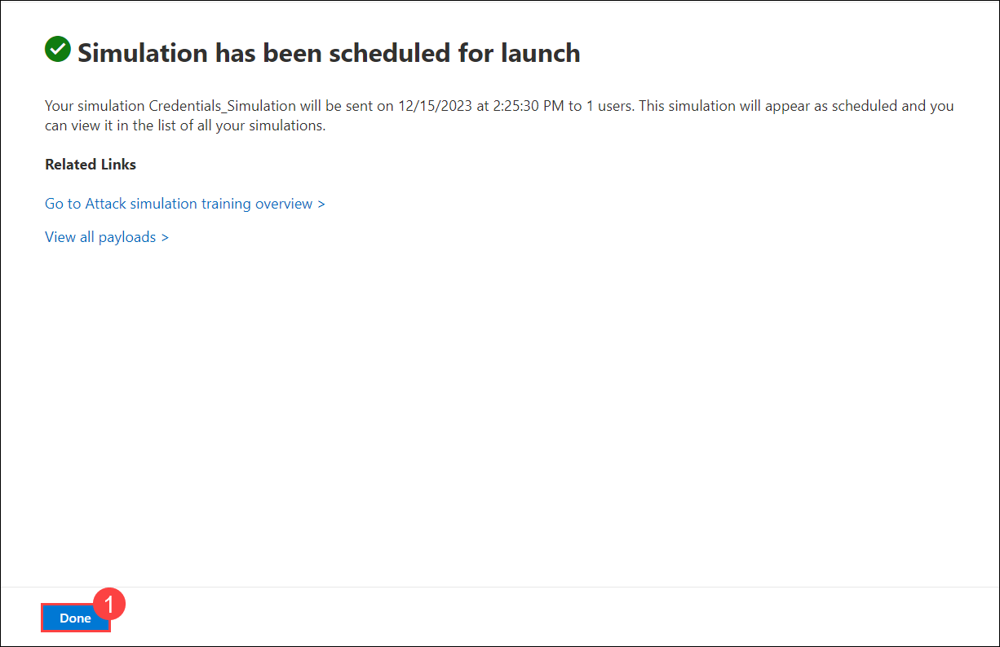

## Review
In this lab, you will complete the following tasks:
- Simulate a Pishing Attack.
   
