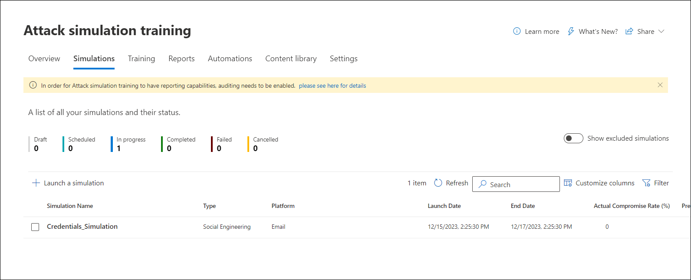
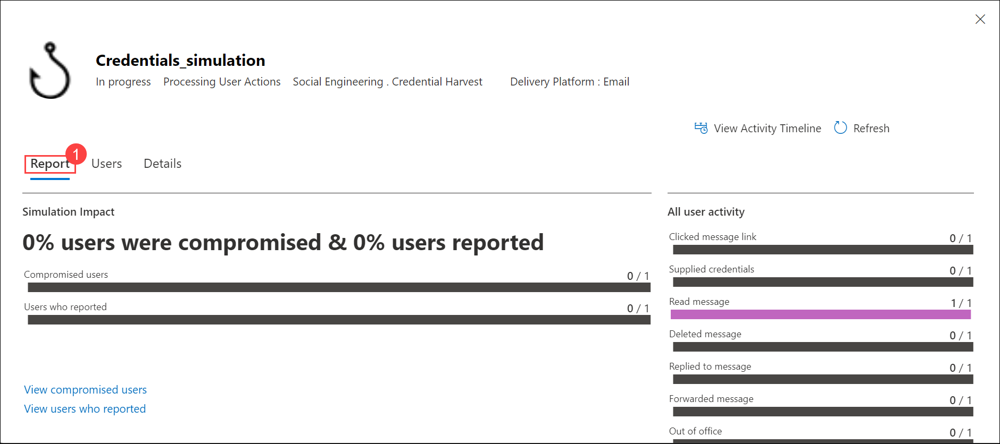
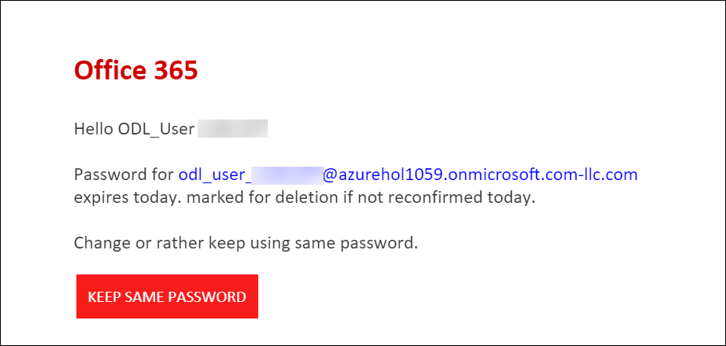
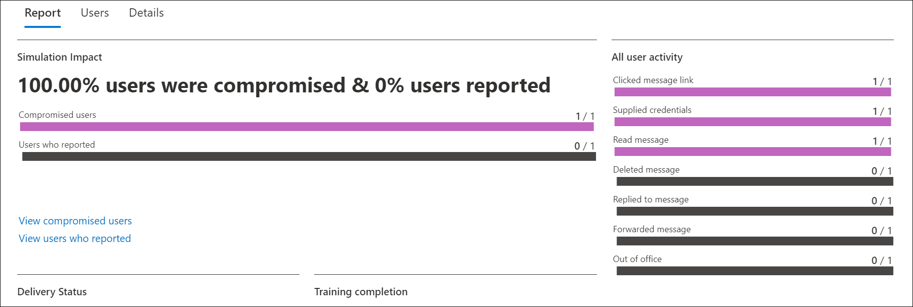

## Lab 06 - Launch Phishing Simulation Campaigns. 

## Lab scenario

In this lab, we will engage in a simulated phishing attack using the Microsoft Defender portal. The objective is to launch a targeted phishing campaign, specifically focusing on credential harvesting techniques. We will navigate through the portal to configure the simulation, including selecting the payload, defining target users, assigning training, and setting up end-user notifications. The exercise culminates in the analysis of user activity and the effectiveness of the phishing simulation through the detailed reports generated by Microsoft Defender.

## Lab objectives (Duration: minutes)

In this lab, you will complete the following tasks:
- Exercise 1: Simulate a Phishing Attack.

## Architecture Diagram

### Exercise 1: Simulate a Phishing Attack.

1. Go to Microsoft Defender portal at https://security.microsoft.com.

1. Go to **Email & collaboration** > **Attack simulation training** > **Simulations** tab and Click on **Launch a Simulation**.

      
   
1. On the **Select technique** page, select **Credential Harvest** and click on **Next**.

      
   
1. On the Name simulation page, configure the following settings:

   - **Name**: Enter a unique, descriptive name (**Credentials_Simulation**) for the simulation.
   - **Description**: Enter an optional detailed description for the simulation.
  When you're finished on the Name simulation page, select **Next**.

   

1. On the **Select payload and login page** page, you need to select **Reset Password** and click on **Next**.

      

1.  On the **Target users** screen, Select **Include only specific users and groups** and click **Add users**.

      

1.  Select for your user, click on **Add 1 User(s)**.

      

1. Click on **Next**.

      

1. On the **Exclude Users** page and click on **Next**.

      

1.  On the **Assign training** page Select the Recommended **Microsoft training experience** and **Assign training for me**, Select **Due Date** as **7 days after Simulation ends**, click on **Next**.

      

1. On the **Select Phish landing page**, select **Use landing pages from library** and **Payload Indicator**, Under *Global landing pages* select **Microsoft Landing Page Template 2** and click on **Next**.

      

1.  **Select end user notification** page, Select **Microsoft default notification (recommended)** and under the *Notifications* section, In the  *Microsoft default notification Positive reinforcement notifications* select the **Deliver during simulations** and in *Microsoft default training reminder notification* select the **Twice a week**, Click on **Next**.

      

1. On the **Launch details** page, Click on **Next**.

      

1. In *Review Simulation* page, **Send a test** and click on **Submit**.

      

1. Click on **Done**.

      

1. It will navigate back to the **Attack Simulation training** page, where it shows the created **simulation**.

      

1. Click on the **Credentials_simulation** and navigate to the **Report** section.

      

1. Users will receive an email notification after some time. The Defender captures and records the user details when the user clicks on the URL, and respective training will be assigned to them.

      

1. Navigate back to the **Report** to check user activity.

       

## Review
In this lab, you will complete the following tasks:
- Simulate a Phishing Attack.
   
