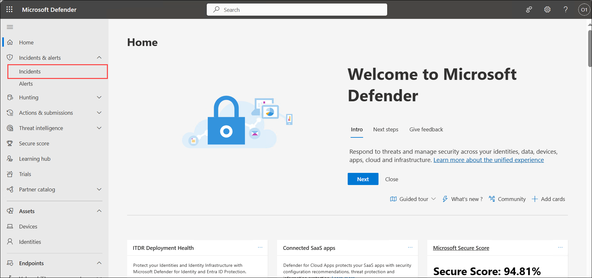
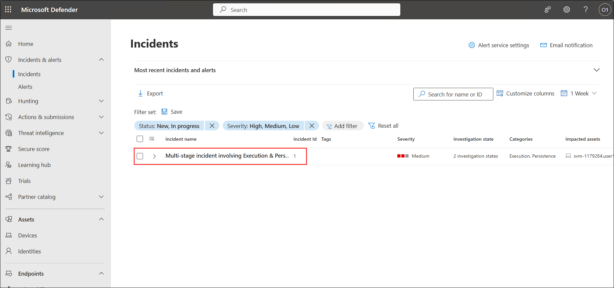
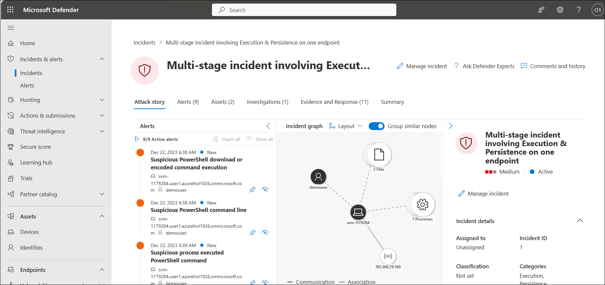

## Lab 07 - Create Incidents 

## Lab scenario

## Lab objectives (Duration: minutes)

In this lab, you will complete the following tasks:
- Exercise 1:
- Exercise 2:
- Exercise 3:

## Architecture Diagram

### Exercise 1: Create Microsoft Entra ID User

In this task, you will create a Microsoft Entra ID User with Global Reader Permission. 

1. On Azure Portal page, in **Search resources, services and docs (G+/)** box at the top of the portal, enter **Microsoft Entra ID**, and then select **Microsoft Entra ID** under services.

   

1. Select **Users** under **Manage** tab.
   
   
   
1. Click on **New user** and select **Create new user**.

   

1. Under the **Basic** tab give you **User principal name** as **TestUser** and enter the **Display name** as **testUser** now give your **Password** and click on **Assignment** tab.

   

1. In **Assignments** page, Click on **Add role** and select **Global Reader** and click on **Select**.

  

1. 

   

1. Select the **Tutorials** tab.

1. Under *Automated investigation (backdoor)* you will see a message describing the scenario. Below this paragraph, click **Read the walkthrough**. A new browser tab opens which includes instructions to perform the simulation.

   

1. In the new browser tab, locate the section named **Run the simulation** (page 5, starting at step 2) and follow the steps to run the attack. **Hint:** The simulation file *RS4_WinATP-Intro-Invoice.docm* can be found back in portal, just below the **Read the walkthrough** you selected in the previous step by selecting the **Get simulation file** button. 

1. After downloading the file,  open the file with **Microsoft Word** and enter the password as `WDATP!diy#`.

1. In the Sign in dialog box, click on **Sign in** copy and paste in the Username and password provided in the environment details page, and select next.    

1. Click **Enable Editing** if the document opens inProtectedView. If you see a subsequent security warning about macros being disabled.    

1. To unblock the document, navigate to its location in File Explorer. In File Explorer, right-click the document, and select Properties. In the General tab, mark the Unblock option under Security.   

1. Close the **Microsoft Word** and re-open from the File Explorer and enter the password as `WDATP!diy#` after re-opening click on **Enable Content** and click on **OK**. 

1. In the Command prompt pop-up press any key to close. 
      
>**Note:** **Congrats – you’re done running the attack!** The attack simulation ends here. A real attacker, if successful, would likely continue to scan for information, send collected reconnaissance information to a command-and-control (C&C) server, and use this information to move laterally and pursue other attractive targets. Next, let’s review and investigate the Defender for Endpoint alerts that surfaced in the simulated attack.

>**Note:** Alerts should start to appear 15-30 minutes after the simulated backdoor is launched.

14. In the Microsoft 365 Defender portal select **Incidents & alerts** from the left menu bar, then select **Incidents**.

   

15. A new incident called "Multi-stage incident..." is in the right pane. Click the incident name to load its details.

   

   

## Review
In this lab, you will complete the following tasks:
- Simulated Attacks to create Incident
