## Lab 07 - Create Incidents 

## Lab scenario
In this lab the key tasks related to create incident in Microsoft Defender. The exercises include creating a Microsoft Entra ID user with Global Reader permissions, enabling all incidents alerts, and simulating an incident by downloading the Tor Browser. The objective is to enhance proficiency in incident identification, response, and resolution within the Microsoft Defender environment.

## Lab objectives (Duration: minutes)

In this lab, you will complete the following tasks:
- Exercise 1: Create Microsoft Entra ID User
- Exercise 2: Turn on All Incidents Alert.
- Exercise 3: Create an Incident.

## Architecture Diagram

### Exercise 1: Create Microsoft Entra ID User

In this task, you will create a Microsoft Entra ID User with Global Reader Permission. 

1. On Azure Portal page, in **Search resources, services and docs (G+/)** box at the top of the portal, enter **Microsoft Entra ID**, and then select **Microsoft Entra ID** under services.

   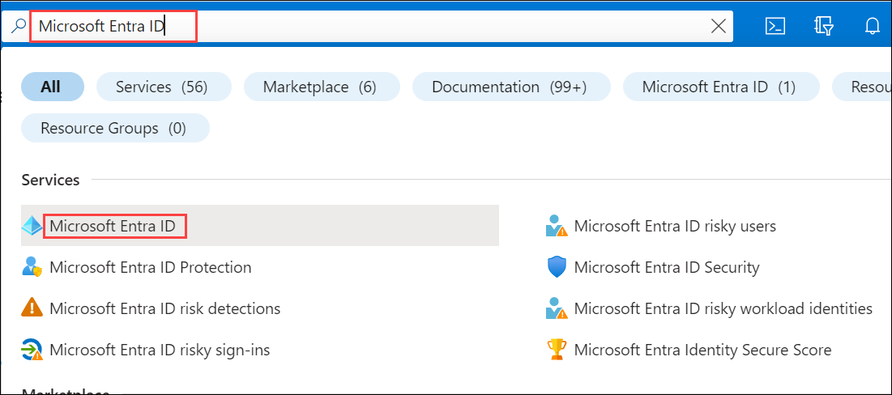

1. Select **Users** under **Manage** tab.
   
   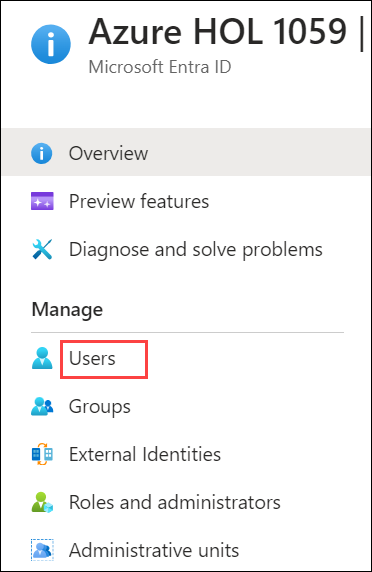
   
1. Click on **New user** and select **Create new user**.

   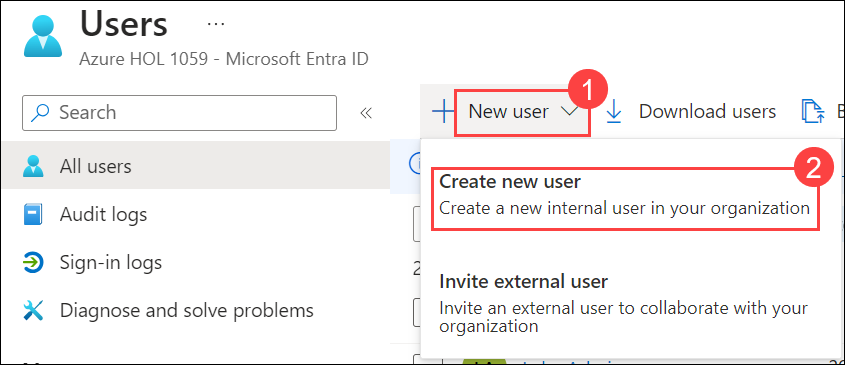

1. Under the **Basic** tab give you **User principal name** as **TestUser** and enter the **Display name** as **testUser** now give your **Password** and click on **Assignment** tab.

   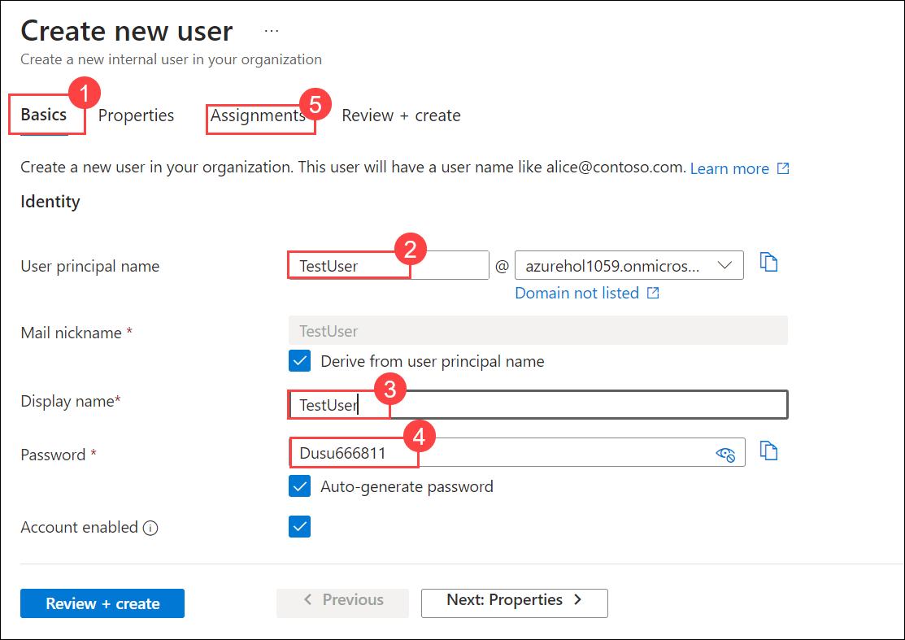

1. In **Assignments** page, Click on **Add role** and select **Global Reader** and click on **Select**.

   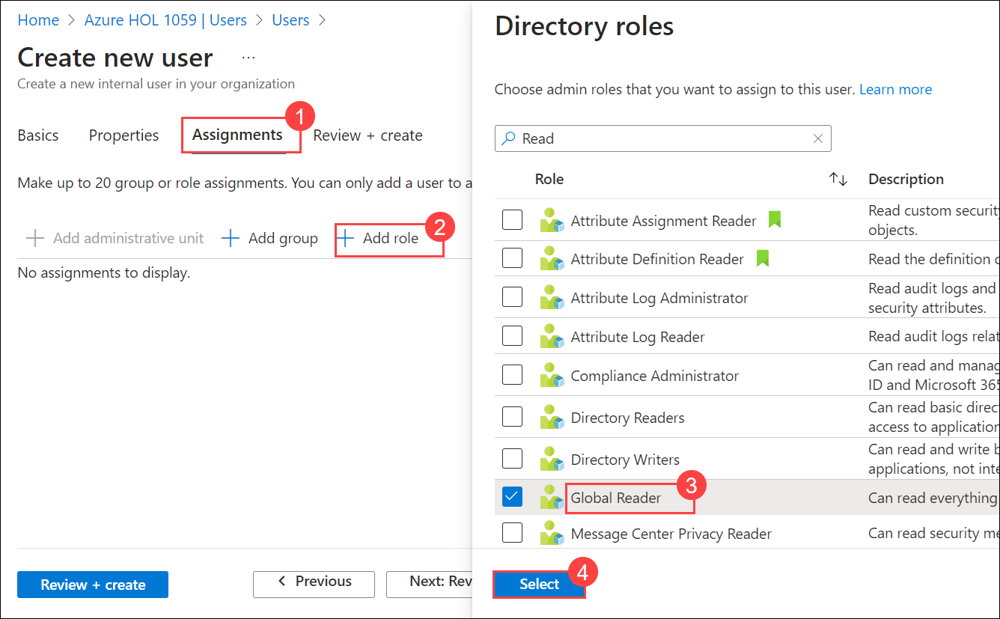

1. Click on **Review + create** to create the user.

### Exercise 2: Turn on All Incidents Alert.

1. Go to Microsoft Defender Portal at https://security.microsoft.com/.

1. Under **Incidents and Alerts**, select **Incidents** and click on **Alert service settings**.

   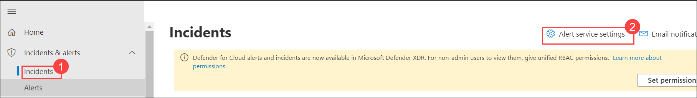

1. Under **Alert service settings**, click on **All Alerts**.

   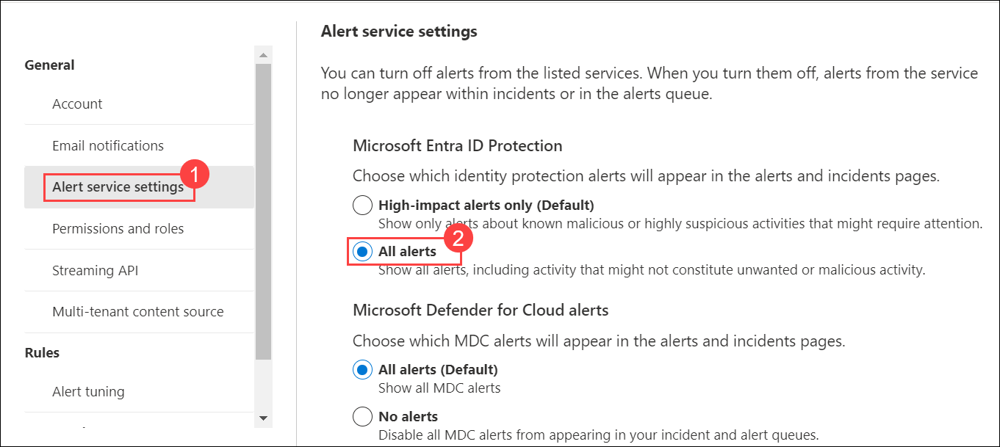
   
1. Enable **We are monitoring all Microsoft Entra ID Protection alerts** and click on **Confirm**.

   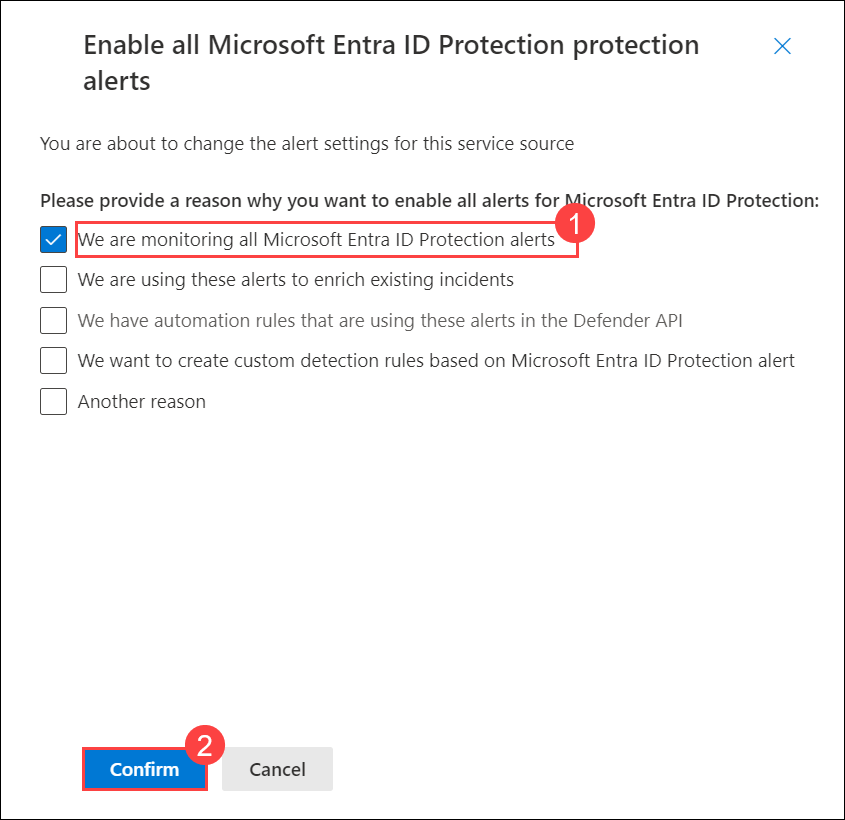

### Exercise 3: Create an Incident.

1. Open a New Tab in browser and search for **tor browser download**, Click on the **Tor Project | Download**.

   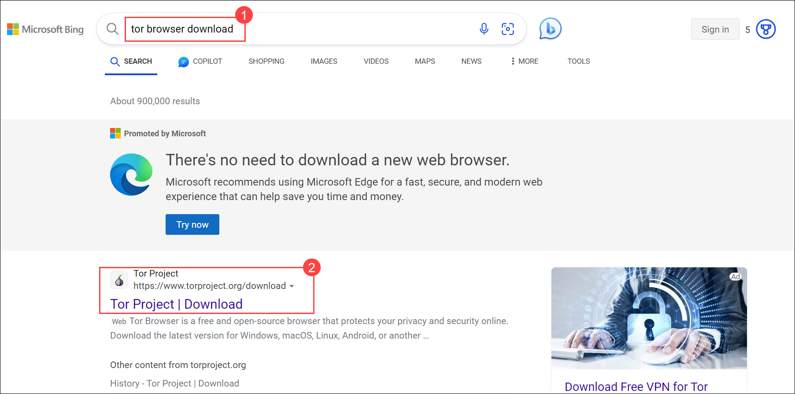

1. Once the website loads scroll down and click on the **Download for Windows** to download the Tor Browser.

   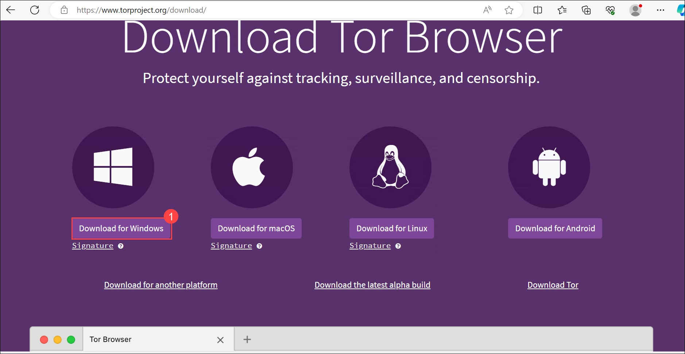

1. Once the browser downloaded successfully, Click to **Open file** and press **OK**, When it ask for Installer Language.

   

1. From **Choose Install Location** page, Click on **Install**.

   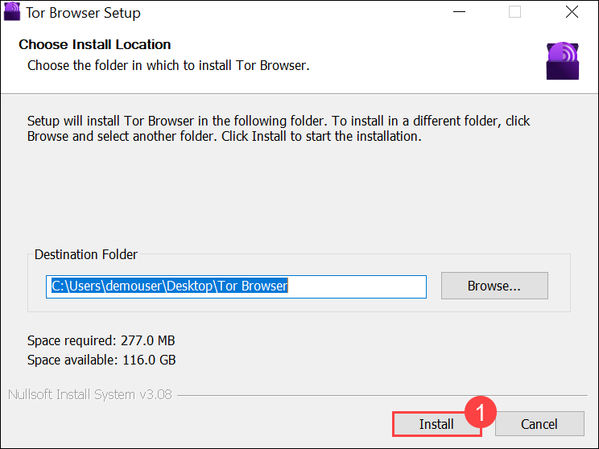

1. Click on **Finish**.

1. Now launch your browser it will ask for **Connect to Tor** and click on **Connect**.

   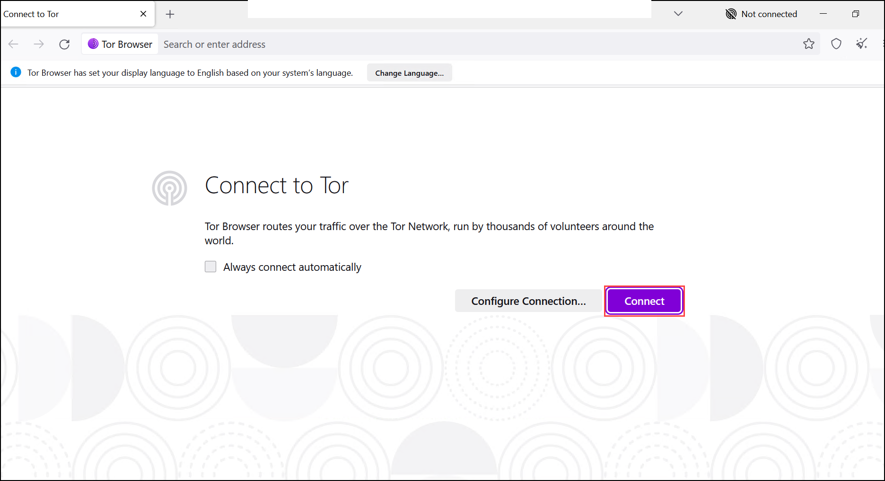

1. In your browser search for the **portal.azure.com** and login with your user credential which you created with the **Global Reader** role you will get the **NoScript XSS Warning** message.

   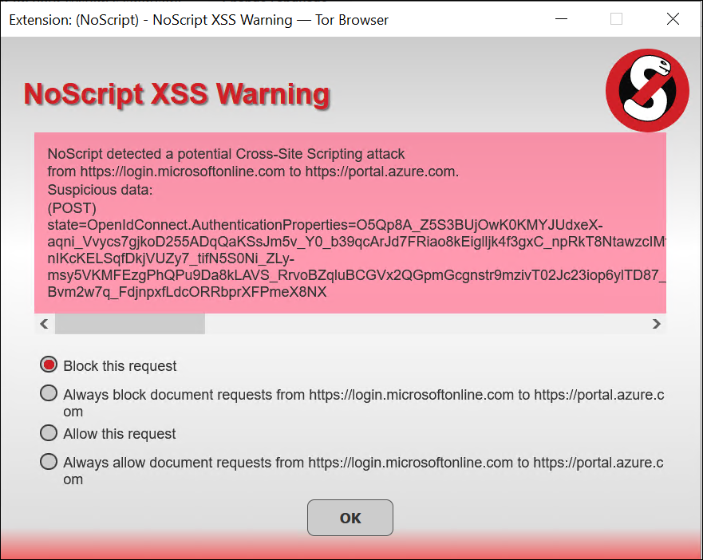

1. Now navigate back to the Microsoft Defender Portal at https://security.microsoft.com/.

1. Under **Incidents and Alerts**, select **Incidents**, It will genrate a **Anonymous IP address involving one user**.

   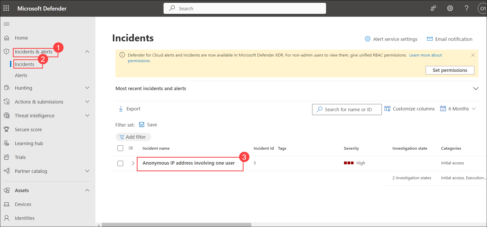

## Review
In this lab, you will complete the following tasks:
- Create Microsoft Entra ID User
- Turn on All Incidents Alert
- Create an Incident
