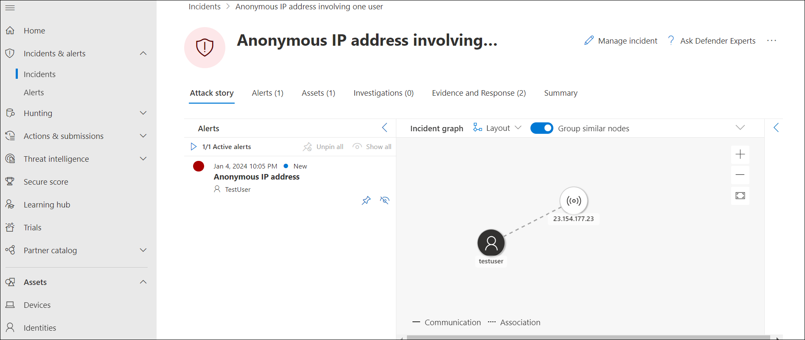
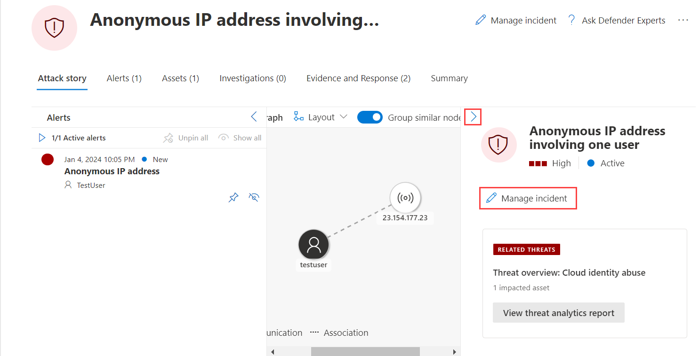
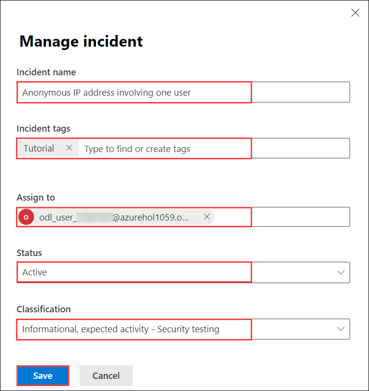

## Lab 08 - Detect & Investigate threats 

## Lab scenario

The lab focuses on the task of detecting and investigating threats within the Microsoft Defender environment. The task is to analysts the actively monitoring security signals, swiftly identifying anomalies, and conducting thorough investigations upon confirming potential threats.

## Lab objectives (Duration: minutes)

In this lab, you will complete the following tasks:
- Exercise 1: Detect & Investigate threats 

## Architecture Diagram

### Exercise 1: Detect & Investigate threats 

1. In the Microsoft 365 Defender portal select **Incidents & alerts** from the left menu bar, then select **Incidents**. A new incident called "Anonymous IP address involving one user" is in the right pane. Click the incident name to load its details.

   
   

1. Select the **Manage incident** button and a new window blade appears.

   

1. In the Manage incident window, You can see that the **Incident Name** is already populated.

1. Under **Incident tags** type "Tutorial" and select **Tutorial (Create new)** to create a new tag. 

1. Select the toggle **Assign to** and add your user account (Me): <inject key="AzureAdUserEmail"></inject> as the owner of the incident. 

1. Under **Classification**, expand the drop-down menu. 

1. Under **Informational, expected activity**, select **Security testing**. 

1. Add any comments if desired and click **Save** to finish.

   

1. Review the contents of the Alerts, Devices, Users, Investigations, Evidence, Response, and Graph tabs. **Hint:** Some tabs might be hidden due to the size of your display. Select the ellipsis tab (...) to make them appear.

>**Warning:** The simulations and tutorials here are an excellent source of learning through practice.  Simulations and tutorials are being added and edited regularly in the portal.  However, some of these simulations & tutorials may interfere with the performance of the labs designed for this training course.  Only perform the simulations and tutorials recommended in the instructions provided for this lab when using the course provided Azure tenant.  You may perform the other simulations and tutorials *after* this training course is complete with this tenant.

## Review
In this lab, you will complete the following tasks:
- Detect & Investigate threats
