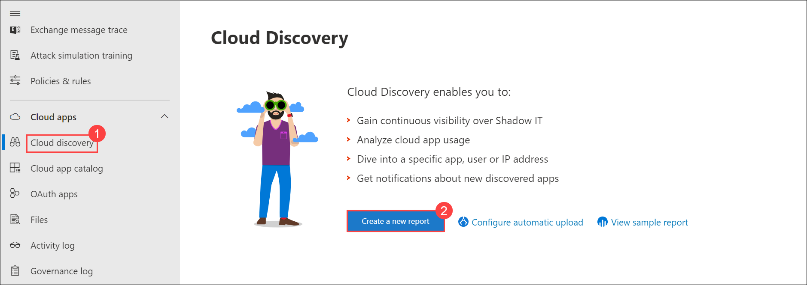
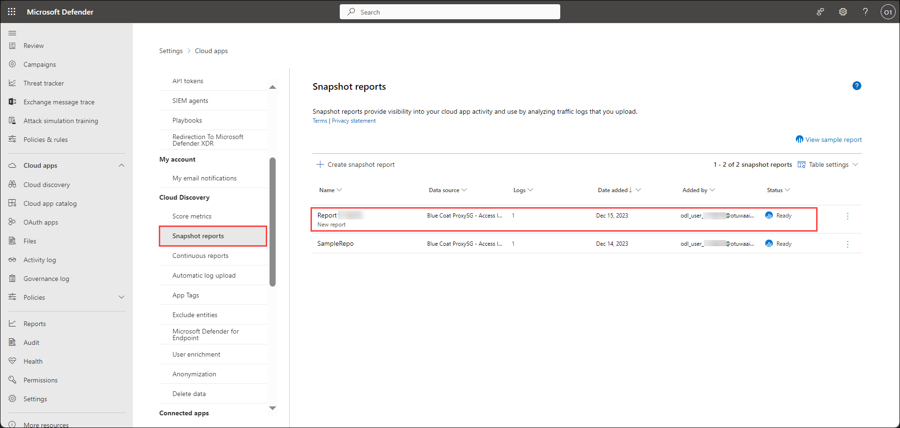
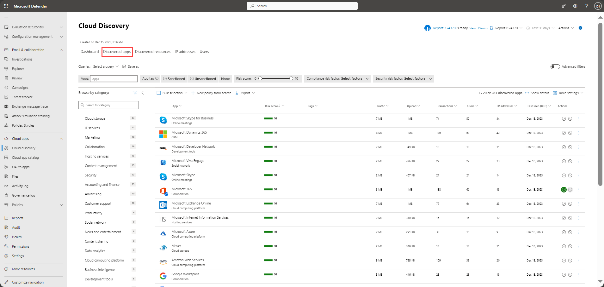

## Lab 09 - Discover Apps 

## Lab scenario

Discovering Apps in the Microsoft 365 Defender suite involves gaining visibility into the applications used across an organization's digital environment. This process aims to comprehensively catalog and understand the landscape of applications, including cloud-based, on-premises, and third-party apps. By leveraging various tools and services within the suite, such as Microsoft Cloud App Security, administrators can identify and assess these applications for security risks, compliance adherence, and data usage patterns.

## Lab objectives (Duration: minutes)

In this lab, you will complete the following tasks:

- Exercise 1: Create a snapshot report to Discovered Apps

## Architecture Diagram

### Exercise 1: Create a snapshot report to Discovered Apps.

1. Collect log files from your firewall and proxy, through which users in your organization access the Internet. Make sure to gather logs during times of peak traffic that are representative of all user activity in your organization.
1. In the Microsoft Defender Portal, under Cloud Apps, select **Cloud discovery** and click on **Create a new report**.

   

1. Provide the details in the report details tab, click on **Download sample log** which we will be using in next step and Select **Next**.
- **Report name** : Report<inject key="DeploymentID" enableCopy="false" /></inject>
- **Description** : New report
- **Source** : Blue coat ProxySG - Access log(W3C)

   

4. Select **Browse** and choose the source from which you want to upload the log files and select the sample log file which was downloaded in previous step. Select **Upload logs**.

   

   > **Note**: Verify your log format to make sure that it's formatted properly according to the sample log you can download. Under Verify your log format, select View log format then select Download sample log. Compare your log with the sample provided to make sure it's compatible.

   >**Note**: Verify your log format to make sure that it's formatted properly according to the sample log you can download. Upload traffic logs that you want to upload. You can upload up to 20 files at once. Compressed and zipped files are also supported.

1. Select **Settings**. Then under Cloud Discovery, select **Snapshot reports**, and select your snapshot report. You can see all the details regarding the report that you have uploaded.

   

1. Select Discovered apps to see all the apps present in the portal.

    

## Review
In this lab, you will complete the following tasks:

- Create a snapshot report to Discovered Apps

