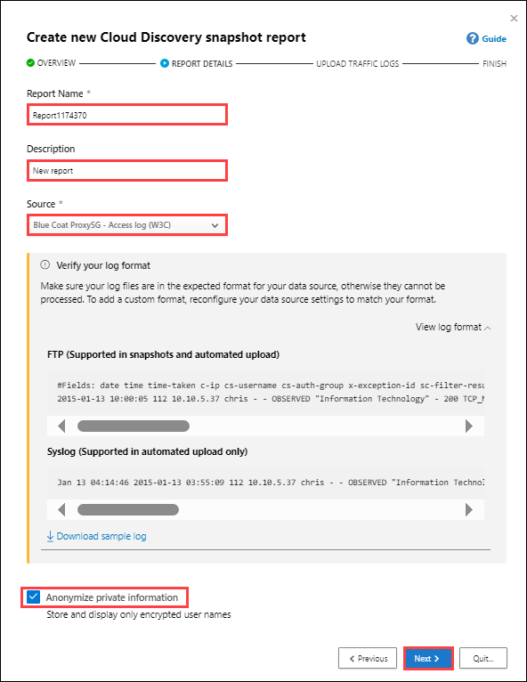

## Lab 09 - Discover Apps 

## Lab scenario
In this lab you will explore about the *Microsoft Defender Portal*.

## Lab objectives (Duration: 120 minutes)

In this lab, you will complete the following tasks:
- Task 1: Enable Defender for Endpoint integration
- Task 1: Configure the severity for alerts
- Task 1: Create a snapshot report

## Architecture Diagram

### Task 1: Enable Defender for Endpoint integration.

1. In [Microsoft Defender XDR](https://security.microsoft.com/), from the navigation pane, select Settings and Select Endpoints.

   

2. Under General, select Advanced features. Toggle the Microsoft Defender for Cloud Apps to On. Select Save preferences.

   

### Task 2: Configure the severity for alerts.

1. In the Microsoft Defender Portal, select Settings. Then choose Cloud Apps. Under Cloud Discovery, select Microsoft Defender for Endpoint.

   

   

2. Under Alerts, select the global severity level for alerts.

   

3. Select Save.

### Task 1: Create a snapshot report.

1. Collect log files from your firewall and proxy, through which users in your organization access the Internet. Make sure to gather logs during times of peak traffic that are representative of all user activity in your organization.
2. In the Microsoft Defender Portal, under Cloud Apps, select Cloud discovery.

   

3. In the top-right corner, pull down Actions, and select Create Cloud Discovery snapshot report. Select Next.

   

4. Enter a Report name and a Description.

   

5. Select Browse and chhose the source from which you want to upload the log files. Select Upload logs.

   

6. Verify your log format to make sure that it's formatted properly according to the sample log you can download. Under Verify your log format, select View log format then select Download sample log. Compare your log with the sample provided to make sure it's compatible.

7. Upload traffic logs that you want to upload. You can upload up to 20 files at once. Compressed and zipped files are also supported.Select Upload logs.After upload completes, the status message will appear at the top-right corner of your screen letting you know that your log was successfully uploaded.

   

9. Select Settings.Then under Cloud Discovery, select Snapshot reports, and select your snapshot report. You can see all the details regarding the report that you have uploaded.

   

10. Select Discovered apps to see all the apps present in the portal.

   
