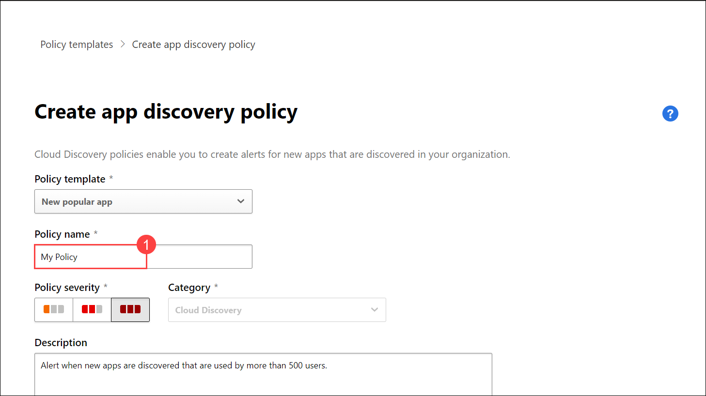
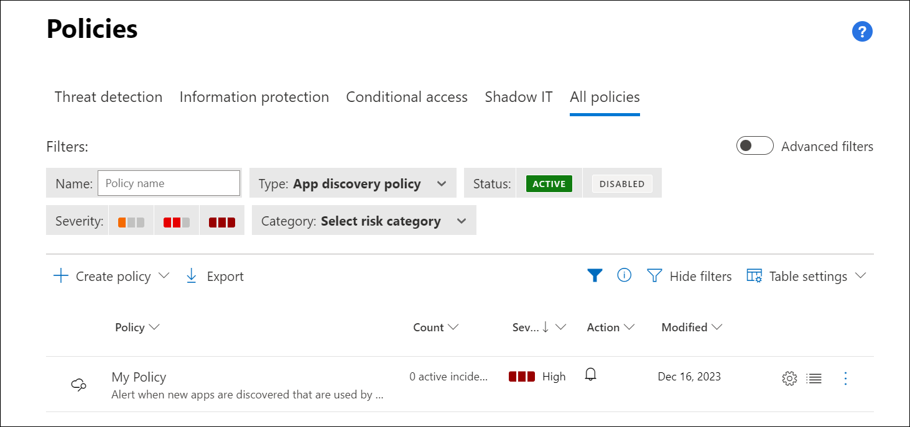

## Lab 10 - Configure App Access Policies 

## Lab scenario
In this lab you will explore about the *Microsoft Defender Portal*.

## Lab objectives (Duration: minutes)

In this lab, you will complete the following tasks:
- Task 1: Create a Policy.

## Architecture Diagram

### Task 1: Create a Policy

1. In the Microsoft Defender Portal, under **Cloud Apps**, go to **Policies** -> **Policy templates**, Search and Select for *New popular apps*, Click on **+**.

      

1. Change the *Policy name* as **My Policy** and Click on **Create**.

      

1. It will navigate to the **Polices** page, Were you can find created policy.

      

## Review
In this lab, you will complete the following tasks:
- Create a Policy.
