## Lab 11 - Setup Alerts & App Governance 

## Lab scenario
In this lab you will explore about the *Microsoft Defender Portal*.

## Lab objectives (Duration: 120 minutes)

In this lab, you will complete the following tasks:
- Task 1: Configure alert notifications in Microsoft Defender XDR
- Task 2: Setup App Governance  

## Architecture Diagram

### Task 1: Configure alert notifications in Microsoft Defender XDR

1. Go to Microsoft Defender XDR and sign in using an account with the Security administrator or Global administrator role assigned.
2. In the navigation pane, select **Settings > Endpoints > General**.

   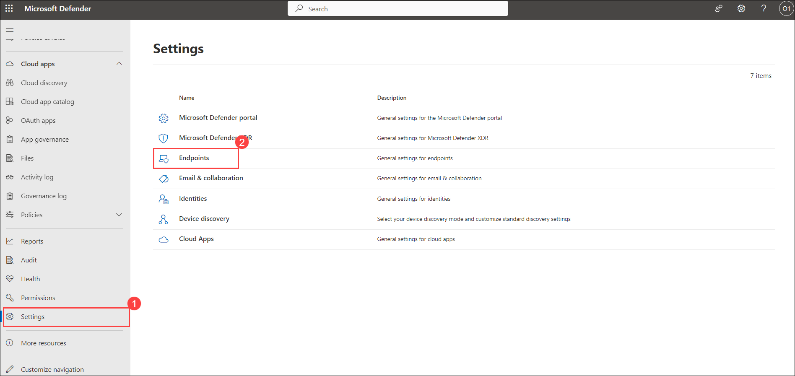

3. Click **Email notifications > Add notification rule**.

   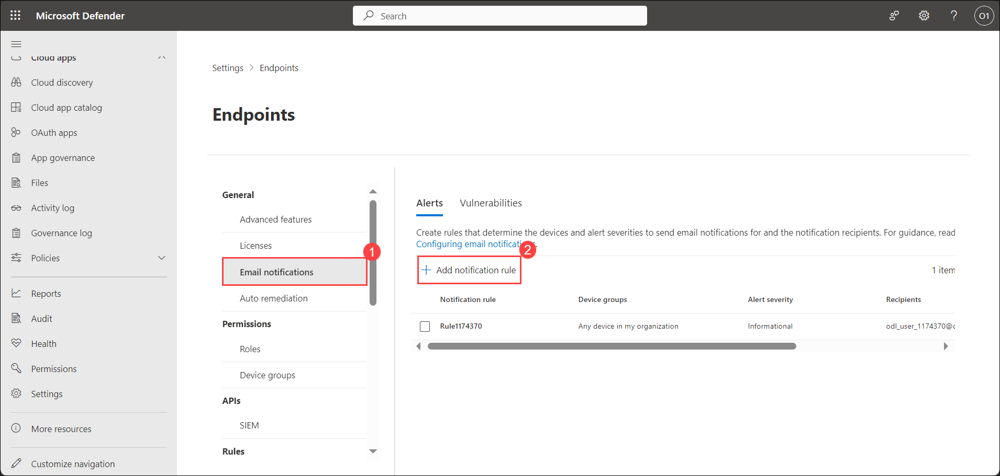

4. Under Create notification rule tab, in Basics option provide **Name : Rule<inject key="DeploymentID" enableCopy="false" /></inject>**. Click **Next**.

   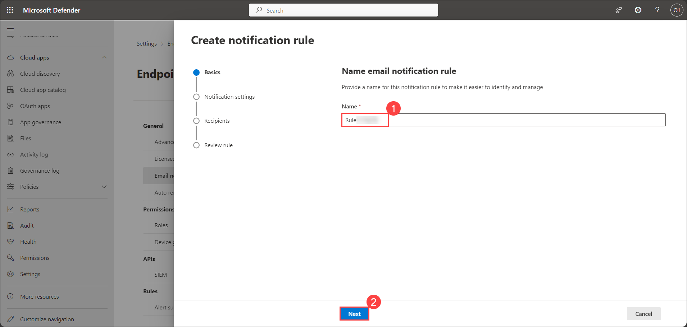

5. Under Create notification rule tab, in Notification settings option, Keep the default option selected and select **Informational** in Alert severity. Click **Next**.

   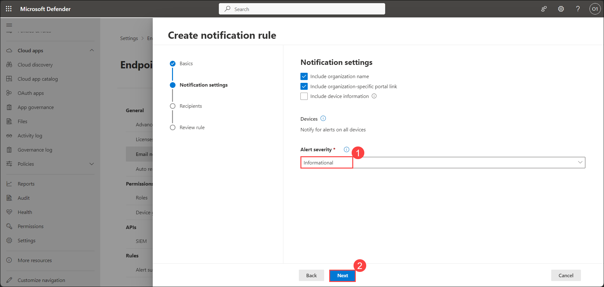

6. Under Create notification rule tab, in Recipients option, provide email id in Recipient email address: <inject key="AzureAdUserEmail"></inject>. Select **Add**.

   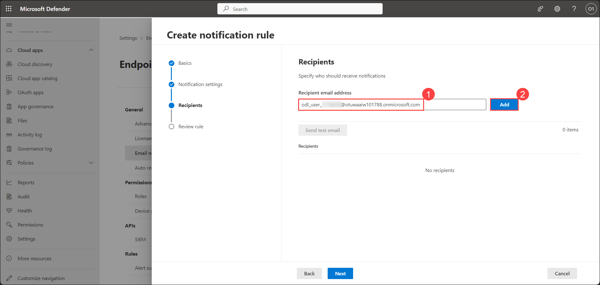

7. Select **Send test email** to check the notification alert's working and Click **Next**.

   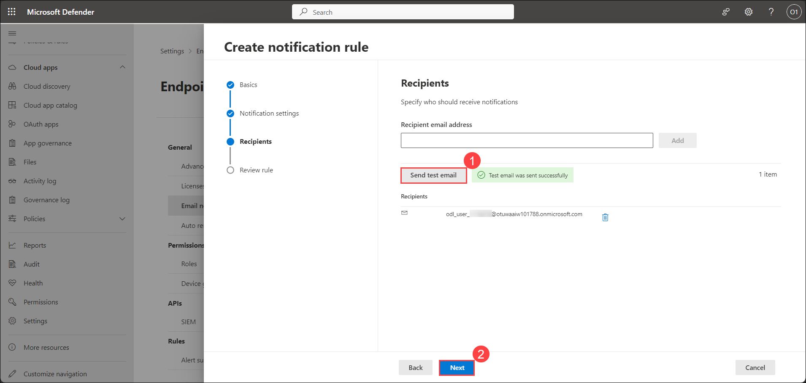

8. Under Review rule tab. Select **Submit** and Click **Done**.

   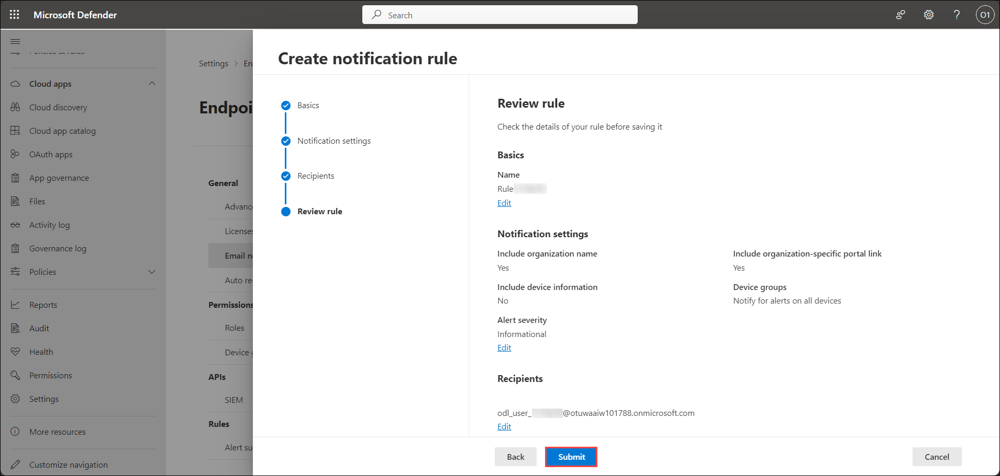

### Task 2: Create OAuth app policies for Microsoft Entra ID

### Task 2.1: Turn on app governance

1. Go to https://security.microsoft.com/ > Settings > Cloud Apps > App governance

   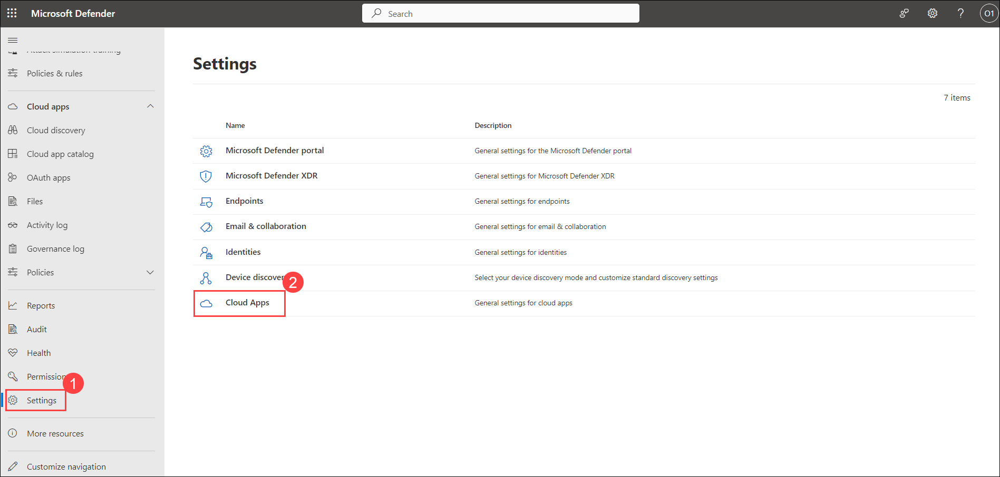

2. Select **Service status** under App governance. Select **Turn on app governance**.

   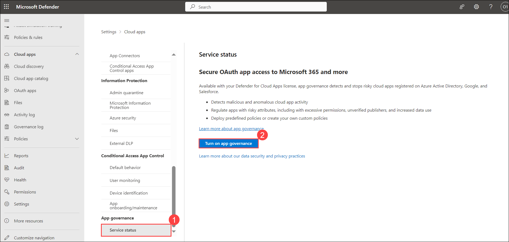
   
**Note**: You'll need to wait up to 10 hours to see and use the product.

3. After getting, app governance provisioned You will see app governance page. In Privacy consent required tab. Select **Accept**.

   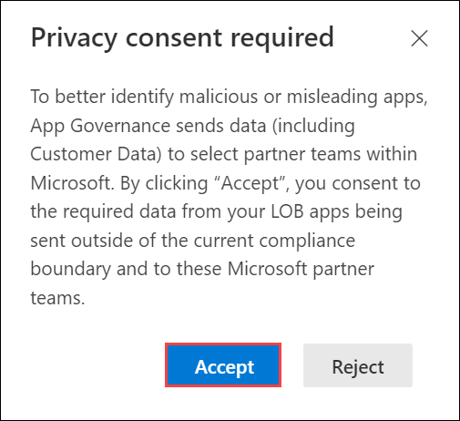

### Task 2.2: Create OAuth app policies for Microsoft Entra ID

1. To create a new app policy for Azure AD apps, go to Microsoft Defender XDR > App governance > Policies > Azure AD > Create new policy.

   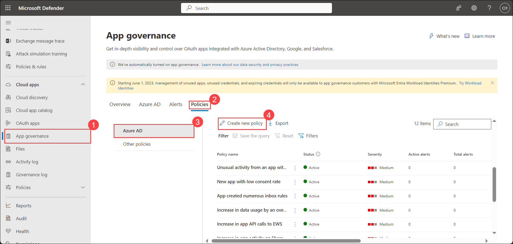

2. To create a custom policy, select the **Custom** category. Under Template select **Custom Policy**. Select **Next**.

   

3. Provide the details and Click **Next**.
- Policy name: Custom Policy <inject key="DeploymentID" enableCopy="false" /></inject>
- Description: Custom Policy <inject key="DeploymentID" enableCopy="false" /></inject>
- Severity: Low

   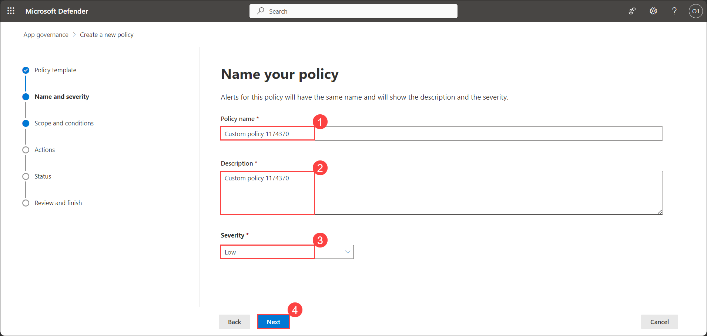

4. Under Set policy scope and conditions tab Select **No, I'll customize the policy**.

   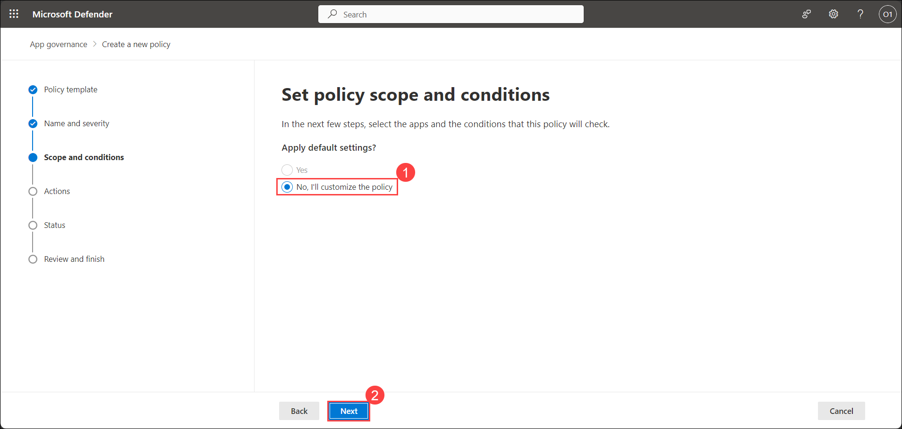

5. Under Set policy scope and conditions. Select Specific Apps and from Choose apps select the application **cpvclodlabsacademy**. Click **Add(1)**.

   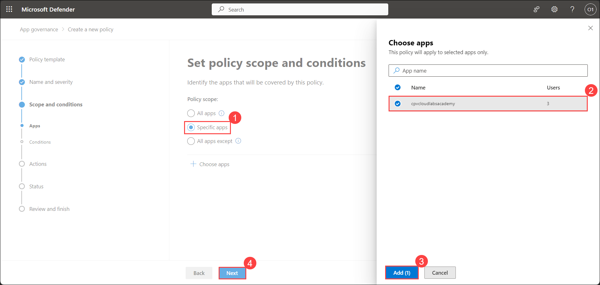

6. In Apply default conditions from the template? Select **No, I'll edit the conditions** and Select **Edit conditions**

   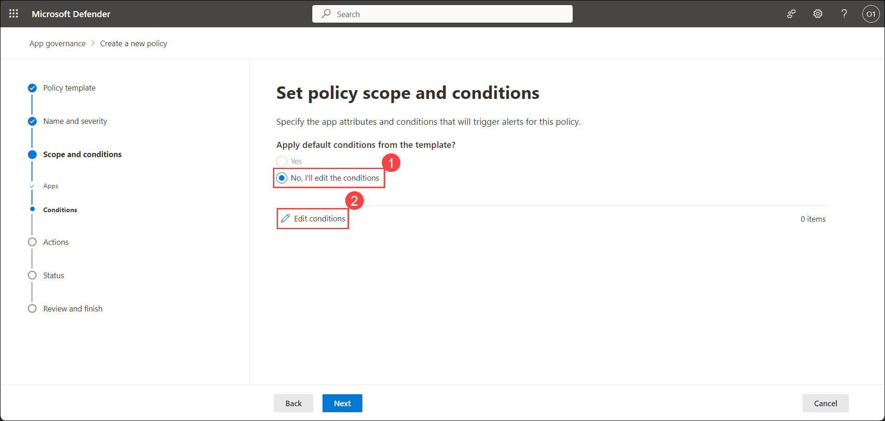

7. Under Edit policy conditions. Select **Add condition** and select **Data usage** and select **Save** and then select **Next**.

   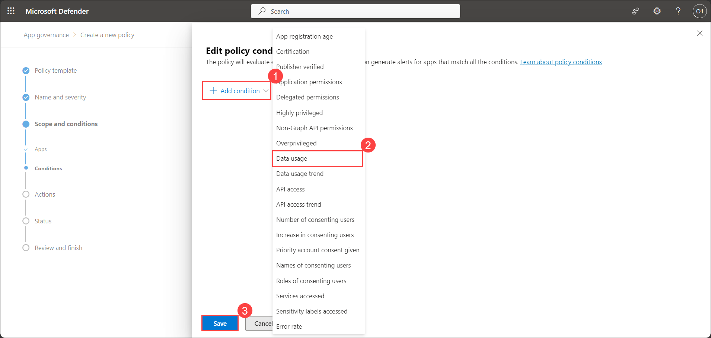

8. Under Set policy action select the check-box next to **Disable app** and select **Next**

   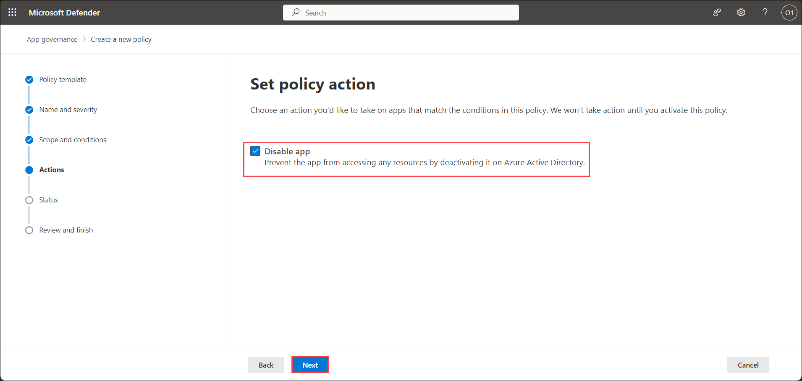

9. Under Set policy status select **Active** and select **Next**

   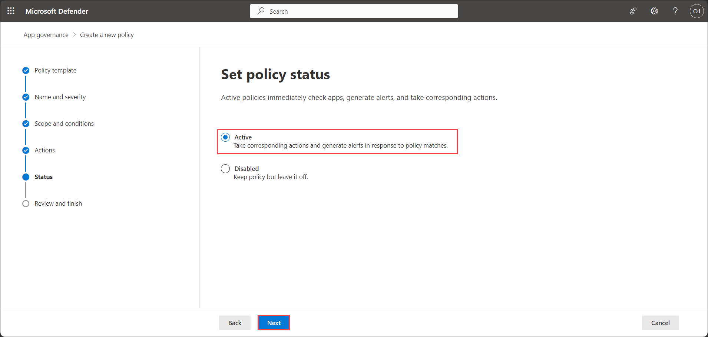

10. Under review your policy select **Submit** and select **Done**

   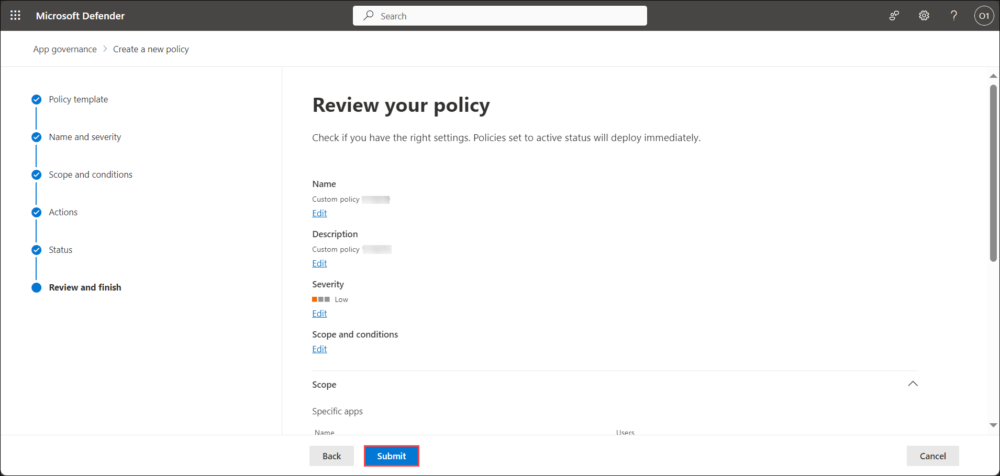

