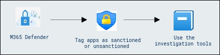
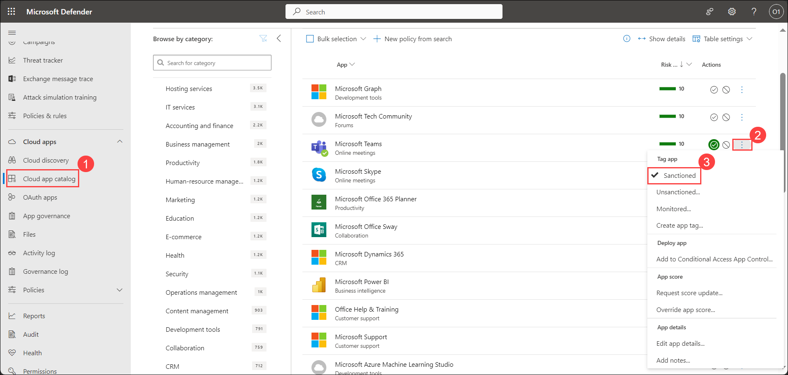
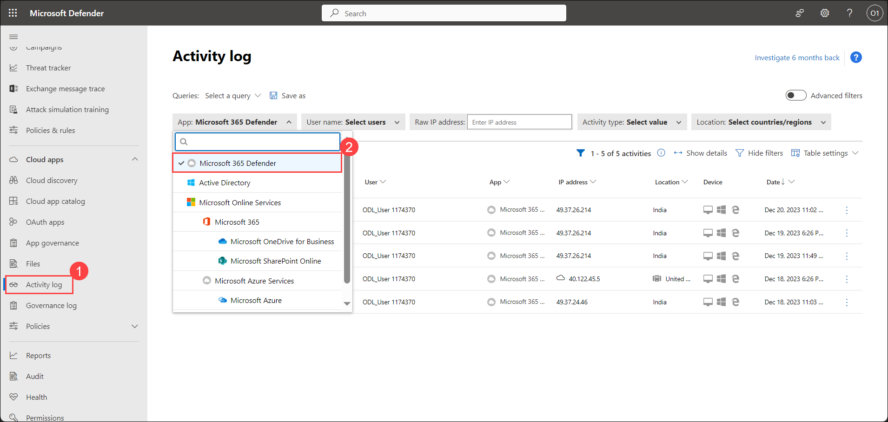
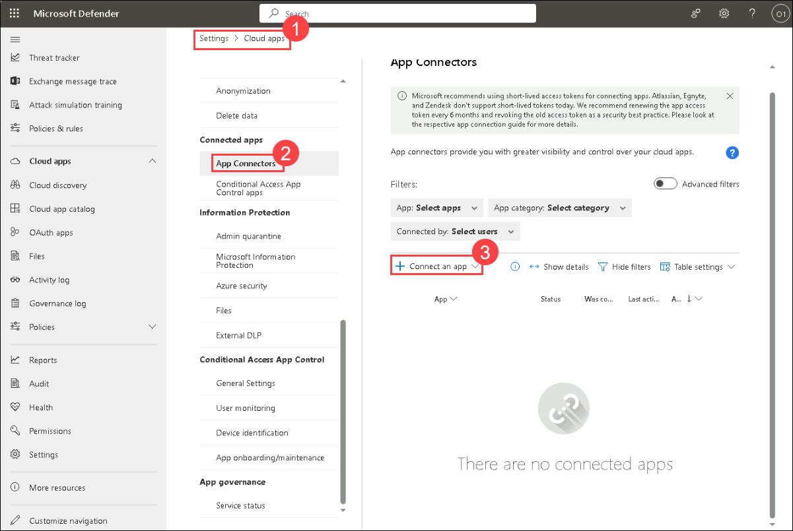
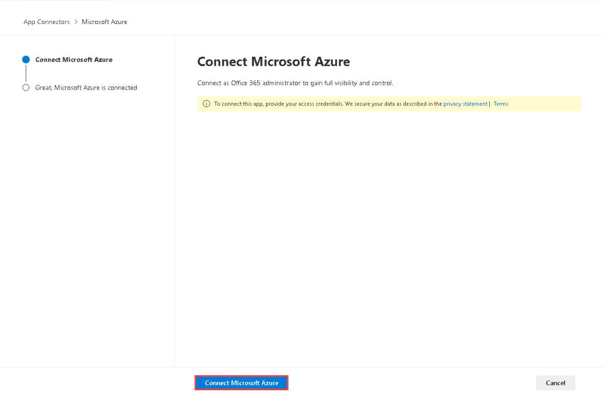
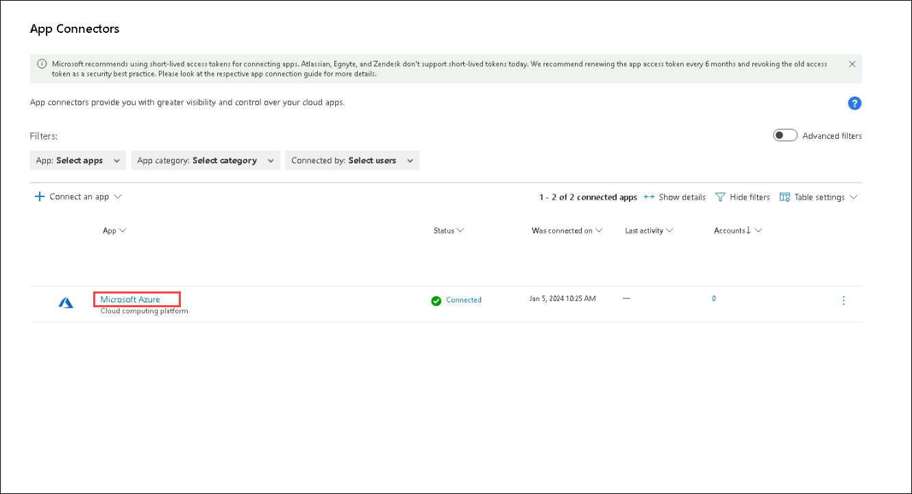
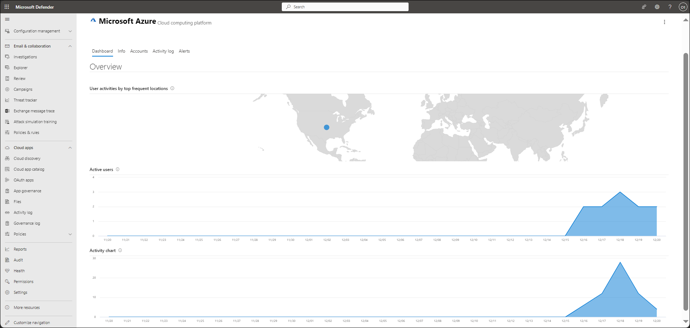
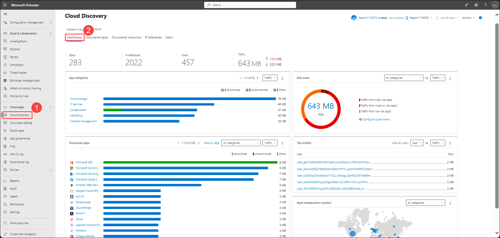

## Lab 12 - Investigate Alerts and activities

## Lab scenario

In this lab, we will delve into investigating alerts and activities within the Microsoft Defender for Cloud environment. The scenario involves addressing security concerns related to cloud applications and user activities. we will have to tag specific apps as either sanctioned or unsanctioned, utilization of investigation tools to meticulously examine the activity log of a designated app and gaining hands-on experience in managing app classifications for security purposes.

## Lab objectives (Duration: 20 minutes)

In this lab, you will complete the following tasks:
- Exercise 1: Tag apps as sanctioned or unsanctioned
- Exercise 2: Use the investigation tools

## Architecture Diagram

   

### Exercise 1: Tag apps as sanctioned or unsanctioned

Sanctioned and unsanctioned are tags that you can apply to the cloud apps that are discovered by Defender for Cloud Apps. Sanctioned apps are those that are approved by your organization, while unsanctioned apps are those that are not.

1. In the Microsoft Defender Portal, under **Cloud Apps**, go to the **Cloud app catalog or Cloud discovery - > Discovered apps**.

2. In the list of apps, on the row in which the app you want to tag as sanctioned appears, choose the three dots at the end of the row Tag as sanctioned dots and choose Sanctioned.

   

### Exercise 2: Use the investigation tools

1. In the Microsoft Defender Portal, under **Cloud Apps**, go to the **Activity log(1)** and filter by a specific app. Select **Microsoft 365 Defender(2)**.

   

2. You can see the **Activity** in the app that you have selected, **User** who have done the activity, **IP address** from which the activity was performed, from which **Location** user has accesses the app and from which **Device** and **Date** the app was accessed.

   

3. In the Microsoft Defender Portal, select **Settings**. Then choose **Cloud Apps**. Under Connected Apps, select **App connectors**, then select **Connect an app** and choose **Microsoft Azure**.

   

1. Click on the **Connect Microsoft Azure** and select **Done**.

   

1. Select app **Microsoft Azure**.

   

1. The app dashboard opens and gives you information and insights.

   

5. In the Microsoft Defender Portal, under Cloud Apps, go to **Cloud Discovery(1)**. Select the **Dashboard(2)** tab and check the following items:

- What cloud apps are being used, to what extent, and by which users?

- For what purposes are they being used?

- How much data is being uploaded to these cloud apps?

- In which categories do you have sanctioned cloud apps, and yet, users are using alternative solutions?

- For the alternative solutions, do you want to unsanction any cloud apps in your organization?

- Are there cloud apps that are used but not in compliance with your organization's policy?

   

5. In the Microsoft Defender Portal, under **Cloud Apps**, go to **Files**. If any files have been shared we can see: How many files are shared publicly so that anyone can access them without a link? With which partners are you sharing files (outbound sharing)? Do any files have a sensitive name? or are any of the files being shared with someone's personal account?

## Review
In this lab, you will complete the following tasks:
- Tag apps as sanctioned or unsanctioned
- Use the investigation tools
