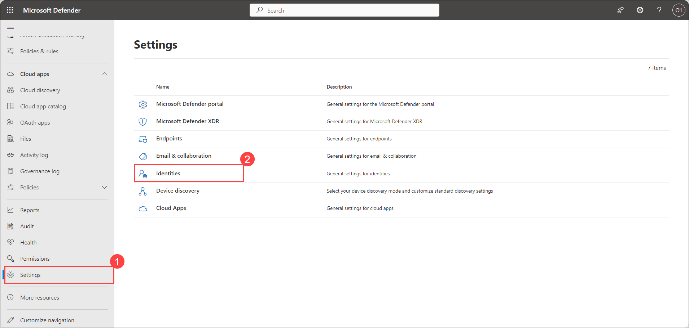
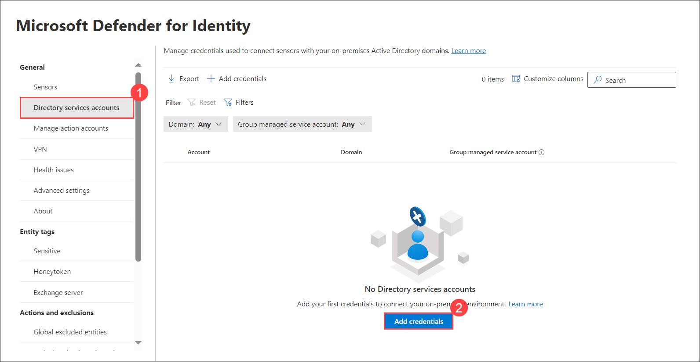
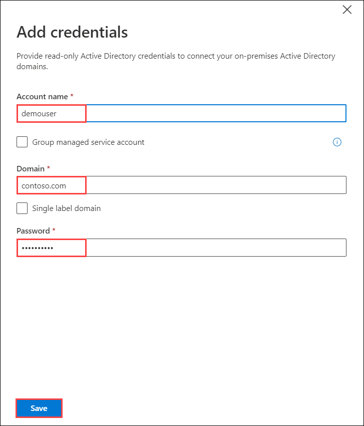
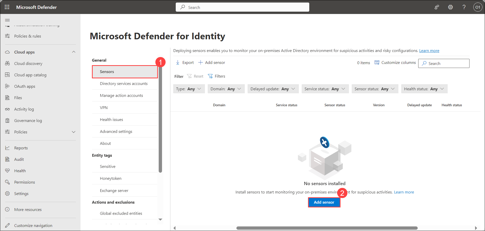
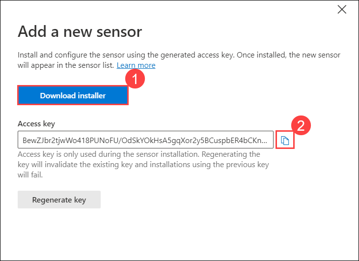
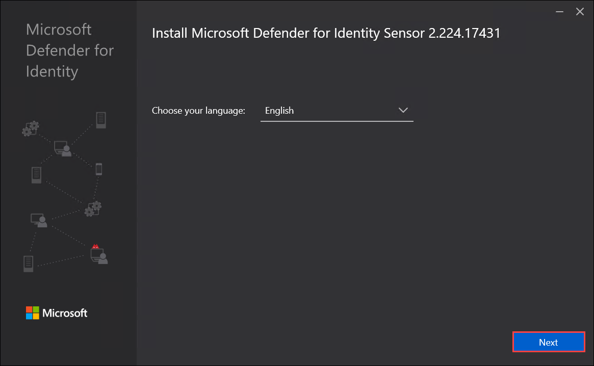
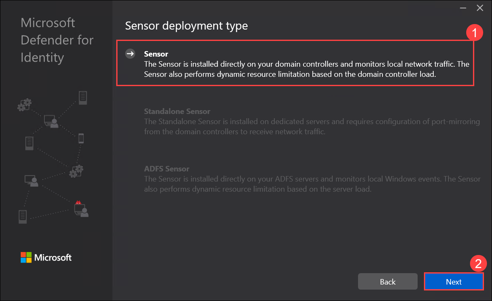
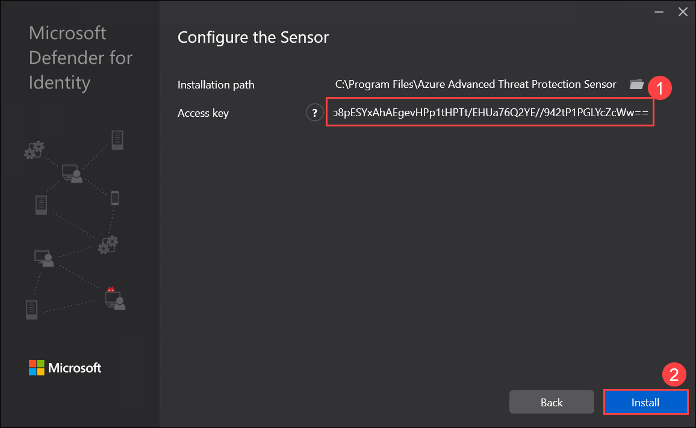

## Lab 14 - Setup Defender for Identity Sensors 

## Lab scenario

In this lab, you will establish a Defender for Identity workspace by connecting it to the Windows Server Active Directory. You will start by adding credentials in the Microsoft Defender Portal to create the workspace and establish connectivity.

Next, within the Microsoft 365 Defender portal, you will download and install the Defender for Identity sensor. This involves downloading the sensor installer package, extracting its contents, and running the setup wizard. During installation, users deploy the sensor, specifying access keys and default settings to fortify overall security measures.

## Lab objectives (Duration: minutes)

In this lab, you will complete the following tasks:
- Exercise 1: Creating a Defender for Identity workspace and Connecting to Windows Server Active Directory
- Exercise 2: Download and Install the Defender for Identity sensor

## Architecture Diagram

### Exercise 1: Creating a Defender for Identity workspace and Connecting to Windows Server Active Directory

Defender for Identity workspace involves establishing a secure environment within Microsoft Defender, enabling comprehensive monitoring and analysis of identity-related activities. Connecting this workspace to Windows Server Active Directory involves adding credentials within the Defender portal, ensuring seamless integration and access to on-premises environment data. This connection enables detailed visibility and analysis of identity-related events and potential security threats within the Active Directory infrastructure, empowering proactive security measures and enhanced threat detection capabilities.

1. To create a Defender for Identity workspace, Go to Microsoft Defender Portal, and from the left menu, select **Settings > Identities**.

   

2. On the General tab, select **Directory services accounts**. To connect your on-premises environment, select **Add credentials**.

   

3. In the Add credentials panel, provide the details and Select **Save**.
- Account name : **demouser**
- Domain : **contoso.com**
- Password : **Provide the DSRM password given during Install Active Directory Domain Services**

   

### Exercise 2: Download and Install the Defender for Identity sensor

The Defender for Identity sensor is a core element in Microsoft Defender, specifically designed to monitor and protect against identity-based threats in a network. Installed on servers like domain controllers, it actively analyzes user authentication activities, swiftly detecting and flagging suspicious behavior or potential threats related to user identities. Its focused role is to provide prompt alerts and insights, contributing to proactive risk mitigation in the network's identity and authentication processes.

1. In the Microsoft 365 Defender portal, from the left menu, select **Settings > Identities**.

   

2. On the General tab, select **Sensors**. On the Sensors page, select **Add Sensor**.

   

3. In the Add a new sensor pane, select **Download installer** and save the installation package locally. The downloaded zip file includes the following files:

- The Defender for Identity sensor installer
- The configuration setting file with the required information to connect to the Defender for Identity cloud service
- Npcap OEM version 1.0, which is automatically installed by the sensor installation if it's not found to be already installed

>**Note**: If the pop-ups are blocked by your browser, allow it to download the file.

4. In the Add a new sensor pane, copy the **Access key** value and save it to a secured location. This access key is a one-time password for use when deploying the sensor, after which communication is performed using certificates for authentication and TLS encryption.

   

>**Note**: You will use the access key while configuring the sensor. Use the Regenerate key button if you ever need to regenerate the new access key. It won't affect any previously deployed sensors, because it's only used for initial registration of the sensor.

5. Extract the installation files from the zip file. Installing directly from the zip file fails.

6. Run **Azure ATP sensor setup.exe** with elevated privileges (Run as administrator) and follow the setup wizard.

7. On the Welcome page, select your language as **English** and select **Next**.

   

8. The installation wizard automatically checks if the server is a domain controller, AD FS server, AC CS server, or a dedicated server. In **Sensor deployment type** screen **Sensor** option will be selected. Click **Next**.

   

9. On the **Configure the sensor** screen, keep installation path as default and provide the setup package access key which was copied before in step 4. Select **Install**.

   

## Review
In this lab, you will complete the following tasks:
- Creating a Defender for Identity workspace and Connecting to Windows Server Active Directory
- Download and Install the Defender for Identity sensor
